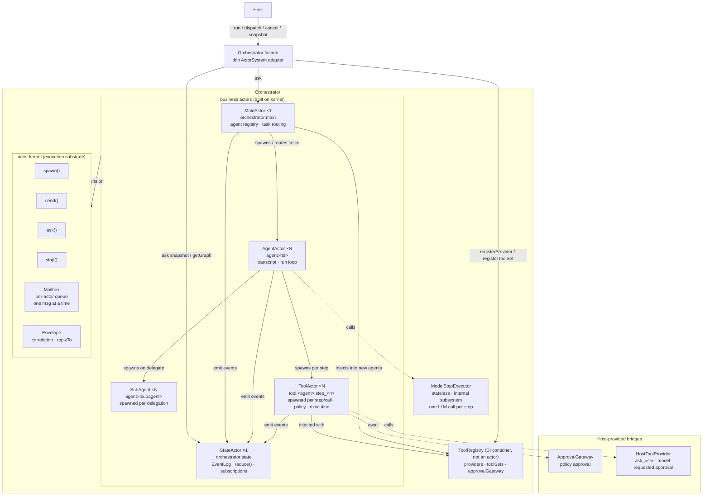

# Orchestrator

Orchestrator is piko's actor-first agent runtime.

It is the layer between Host and the LLM. Host owns UI, sessions,
settings, auth, and persistence. The ModelStepExecutor (internal subsystem)
handles one LLM step. Orchestrator owns agents, tasks, actor coordination,
tool routing, event state, and graph projection. Tool sensitivity is
coordinated by ToolActor, while runtime user approval is requested through
the Host-provided ApprovalGateway.

The current design intentionally does not preserve earlier Orchestrator code
shape.

## Two-layer structure

```text
Business actors  (MainActor, AgentActor, ToolActor, StateActor)
        │  built on
        ▼
Actor kernel     (Mailbox, Envelope, spawn/send/ask/stop)
```

- **Kernel** (`kernel/`) — generic, zero piko-specific imports. Provides the execution substrate: per-actor mailboxes, message envelopes with correlation IDs for `ask()` request-response, spawn/stop lifecycle.
- **Business actors** (`actors/`) — piko-specific runtime behavior built on the kernel. Each actor has private state, processes one message at a time, and communicates via `send()` (fire-and-forget) or `ask()` (request-response).
- **ToolRegistry** — a DI container (not an actor). Holds singleton references to providers, toolSets, and approval gateway. Injects these into each fresh ToolActor at spawn time.

## Core Direction

- Use a generic actor kernel as the execution substrate.
- Support concurrent work across actors while keeping each actor internally
  sequential.
- Keep the public Orchestrator facade thin.
- Put runtime behavior in actors.
- Use `async/await` as the pause/resume mechanism for waiting on tools,
  Host/user input, subagents, and state ingestion.
- Model public state with `StateActor`, not a thick facade-owned reducer.
- Keep Host out of actor internals.
- Keep ModelStepExecutor (internal) stateless and step-oriented.

## Architecture


The `kernel/` layer must not import engine, host, or piko-specific agent types.
Business actors live above the kernel.

## Design Docs

- [Architecture](docs/architecture.md) - boundaries and facade shape.
- [Actor Kernel](docs/actor-kernel.md) - actor IDs, envelopes, mailbox semantics,
  communication, failure, cancellation.
- [Actors](docs/actors/) - MainActor, AgentActor, ToolActor, StateActor,
  subagents, watches.
- [Tools](docs/tools/) - ToolProvider, ToolSet, and preset tool inventory.
- [Events And State](docs/events-and-state.md) - OrchestratorEvent,
  `StateActor`, event ingestion, reducer, snapshot, graph.
- [Host Integration](docs/host-integration.md) - Host responsibilities and
  forbidden coupling.

## ModelStepExecutor

The orchestrator's model interaction is through the `ModelStepExecutor`
interface (internal subsystem). See [docs/model-step-executor.md](docs/model-step-executor.md).

The `ModelStepExecutor` may have local/native/remote implementations, but
that is **not** the runtime protocol boundary. The orchestrator's remote
boundary is its public API (registerAgent, run, subscribe, snapshot).

## Public API Sketch

```ts
export interface Orchestrator {
  registerAgent(spec: AgentSpec): void;
  unregisterAgent(agentId: string): void;
  registerToolSet(toolSet: ToolSet): void;
  unregisterToolSet(toolSetId: string): void;
  setModelConfig(config: OrchModelConfig): void;
  setApprovalGateway(gateway: ApprovalGateway | undefined): void;
  registerProvider(provider: ToolProvider): void;
  dispatch(task: AgentTask): Promise<AgentTaskId>;
  run(prompt: string, opts?: OrchRunOptions): Promise<OrchRunResult>;
  subscribe(listener: HostEventListener): () => void;
  snapshot(): OrchState;
}
```

The API returns promises where calls cross actor boundaries. The facade should
not run its own scheduler; it should translate API calls into actor messages.
