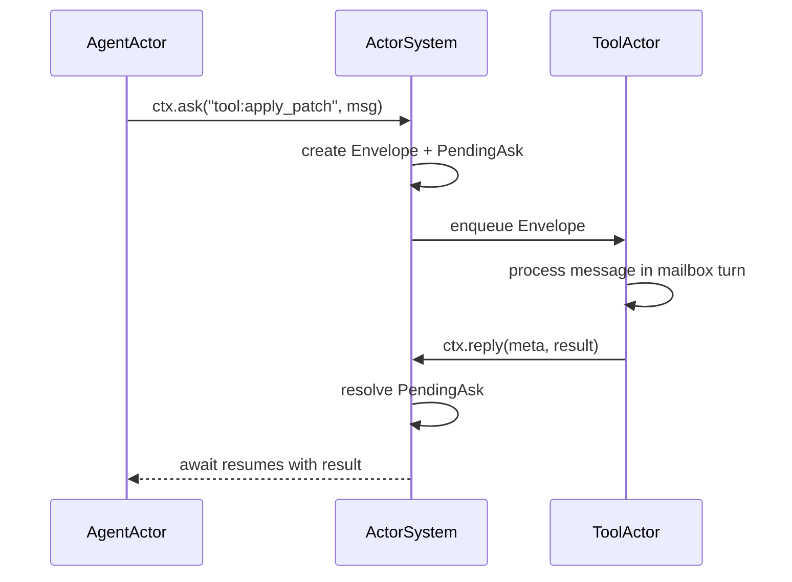
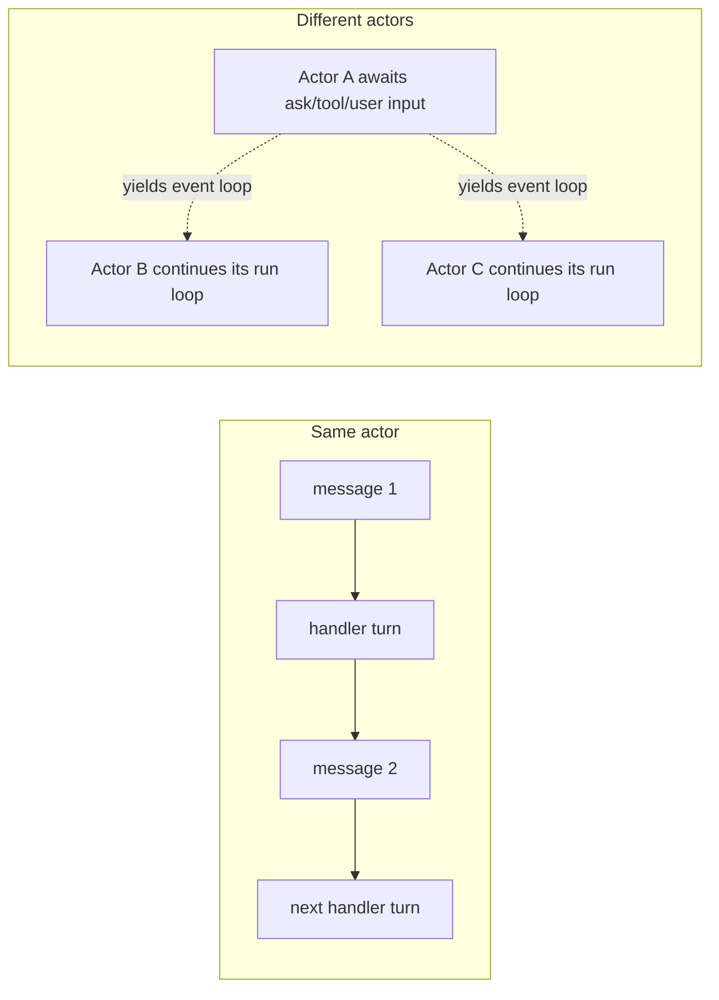
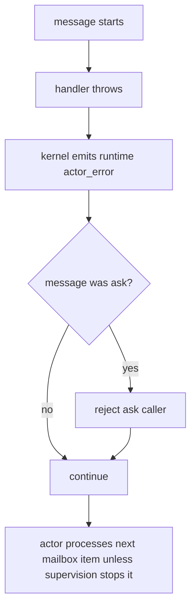

# Actor Kernel

The actor kernel is a generic in-process actor system. It should be usable like
a third-party library: it does not know piko, agents, tools, Host, or Engine.

## Actor Identity

Actor IDs are stable strings.

Recommended Orchestrator namespaces:

```text
orchestrator:main
orchestrator:state
agent:<agentId>
tool:registry
timer
```

## Envelope

Every message is wrapped by the kernel.

```ts
export interface Envelope<T = unknown> {
  id: string;
  to: ActorId;
  from?: ActorId;
  payload: T;
  correlationId?: string;
  replyTo?: ActorId;
  causationId?: string;
  createdAt: number;
  deadlineAt?: number;
}
```

Actor code should not forge correlation IDs by hand.

## Handler

```ts
export type ActorHandler<Msg = unknown> = (
  msg: Msg,
  ctx: ActorContext,
  meta: Envelope<Msg>,
) => Promise<void> | void;
```

An actor is a handler plus private closure state plus one mailbox.

## Context

```ts
export interface ActorContext {
  readonly self: ActorRef;

  send(target: ActorId, msg: unknown, options?: SendOptions): void;
  ask<T>(target: ActorId, msg: unknown, options?: AskOptions): Promise<T>;
  reply<T>(meta: Envelope, result: T): void;
  reject(meta: Envelope, error: unknown): void;

  spawn(spec: SpawnSpec): ActorRef;
  stop(target: ActorId, reason?: string): Promise<void>;

  now(): number;
}
```

The kernel context stays generic. Business event publishing is injected into
piko actors separately.

## Communication

Actors do not call each other directly and do not hold another actor's handler,
private state, or mailbox. They only communicate through `ActorContext`.



`ActorRef` is an address/capability, not an object pointer:

```ts
interface ActorRef {
  id: ActorId;
  kind?: string;
}
```

The kernel owns:

- `Map<ActorId, ActorCell>`
- every actor mailbox
- pending ask resolvers
- envelope creation and correlation IDs
- actor lifecycle and stop state

Actor code never receives `ActorCell` and cannot bypass the kernel to push
directly into another mailbox.

## Mailbox Semantics

- FIFO per actor.
- One active handler invocation per actor.
- Bounded mailbox by default.
- `send()` to a full mailbox throws `MailboxFullError`.
- `ask()` to a full mailbox rejects.
- `stop()` closes the mailbox, rejects pending asks targeting the actor, then
  waits for the current handler to finish or for a stop timeout.

## Parallelism

The actor kernel supports concurrency across actors, not inside one actor.



There are no worker threads in the base design. Parallelism comes from
JavaScript async scheduling: an actor that awaits `ask()`, engine streaming,
tool execution, user input, or a timer yields the event loop.

This means:

- `MainActor` can wait on `AgentActor` while `ToolActor` and `StateActor` keep
  running.
- `AgentActor A` can run while `AgentActor B` waits for user input.
- One AgentActor cannot process two mailbox messages at the same time unless it
  explicitly spawns child actors for per-task concurrency.

If an actor needs to start work and continue before the result is available, it
must model that as fire-and-later-join state: send/spawn work, remember a
handle, continue, then await or process the result at an explicit join point.

## Failure

Runtime-level handler failures do not kill the whole Orchestrator.



Business failures are modeled by business actors as Orchestrator events, for
example `task_failed`.

## Cancellation And Deadlines

Cancellation sources:

- Host calls `cancelTask(taskId)`.
- Orchestrator is stopping.
- `ask()` deadline expires.
- Agent reaches max steps.

Required business cleanup belongs in actors:

- reject pending asks for the task
- release or cancel task-scoped resources owned by business actors/providers
- resolve task to `cancelled` or `failed`
- emit terminal task event exactly once
