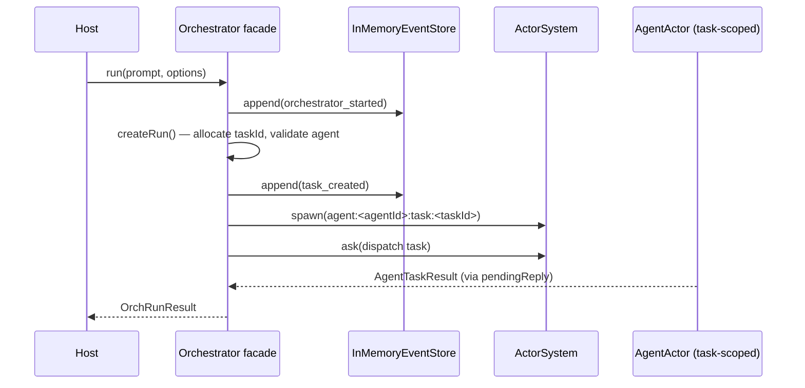
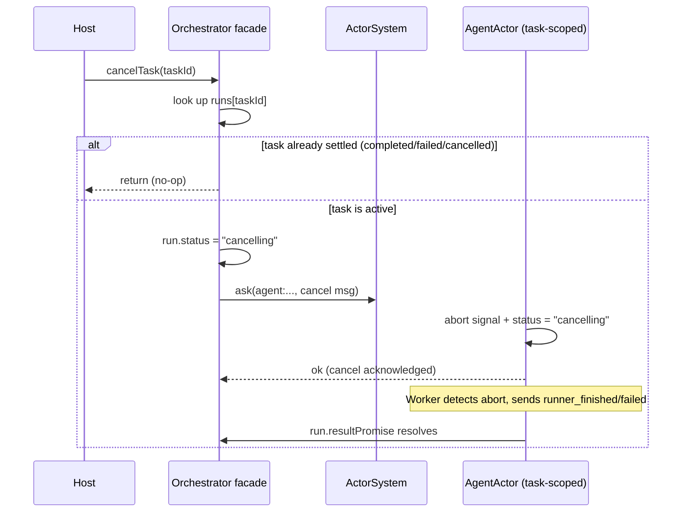

# Orchestrator Facade (formerly MainActor)

> [!NOTE]
> `MainActor` (`orchestrator:main`) no longer exists as an actor with a mailbox.
> Task coordination that was previously described as routing through `orchestrator:main`
> is now handled directly by the `Orchestrator` class and its helper modules
> (`task.ts`, `agent.ts`, `state.ts`, `tool.ts`).

## Current Design

The `Orchestrator` class is the DI root and public API facade. It:

- Stores `agentSpecs: Map<string, AgentSpec>` — registered agent specs
- Stores `runs: Map<string, RunHandle>` — active/recent task run handles
- Stores `allocatedTaskIds: Set<string>` — permanent record of all ever-used task IDs (prevents reuse after eviction)
- Holds a reference to `InMemoryEventStore`, `ToolRegistryImpl`, `ModelStepExecutor`, and `ActorSystem`

Public API calls are **direct method calls** on the Orchestrator object, **not** actor messages:

```text
orchestrator.run(prompt)           → task.run(ctx, prompt, opts)
orchestrator.dispatch(task)        → task.dispatch(ctx, task)
orchestrator.cancelTask(taskId)    → task.cancelTask(ctx, taskId)
orchestrator.registerAgent(spec)   → agent.registerAgent(ctx, spec)
orchestrator.snapshot()            → ctx.eventStore.snapshot()
orchestrator.subscribe(listener)   → ctx.eventStore.subscribe(listener)
```

## Task Dispatch Flow



## Run Handle

`createRun()` returns a `RunHandle` which tracks the task's status and
wraps `resultPromise`. The handle is stored in `ctx.runs`:

```ts
interface RunHandle {
  taskId: string;
  agentId: string;
  actorId: string;   // "agent:<agentId>:task:<taskId>"
  status: "starting" | "running" | "cancelling" | "completed" | "failed" | "cancelled";
  retainForJoin: boolean;
  resultPromise: Promise<any>;
}
```

When there are 100 or more settled runs, `createRun()` evicts settled
non-detached entries to prevent memory growth. Detached runs have
`retainForJoin: true` and remain addressable for repeated `joinTask()` calls for
the lifetime of the Orchestrator. Task IDs are still tracked in
`allocatedTaskIds` after non-detached eviction so they cannot be reused.

## Cancellation Flow



## Agent Registration

`registerAgent(spec)` and `unregisterAgent(agentId)` are synchronous mutations
on `ctx.agentSpecs`. They emit `agent_registered` / `agent_unregistered` events.
No actor is spawned for the agent itself — actors are spawned per task.

## Task ID Uniqueness

- `allocatedTaskIds.has(taskId)` is checked before any task is created
- If the ID has ever been used, `createRun()` throws `"Duplicate task ID: <id>"`
- This guarantee holds even after `runs` eviction

## Invariants

- `task_created` is emitted before the AgentActor actor is spawned.
- `task_started` is emitted by the AgentActor actor at the beginning of `handleDispatch`.
- `task_created` ordering is enforced by `allocatedTaskIds` before insertion.
- `cancelTask` only transitions to `"cancelling"` if the run is active; it is a no-op for settled tasks.
- `cancelTask` rolls back the `"cancelling"` transition if the actor ask fails (e.g. `ActorNotFoundError`).
- Every public task operation returns a clear not-found error for unknown task IDs.
