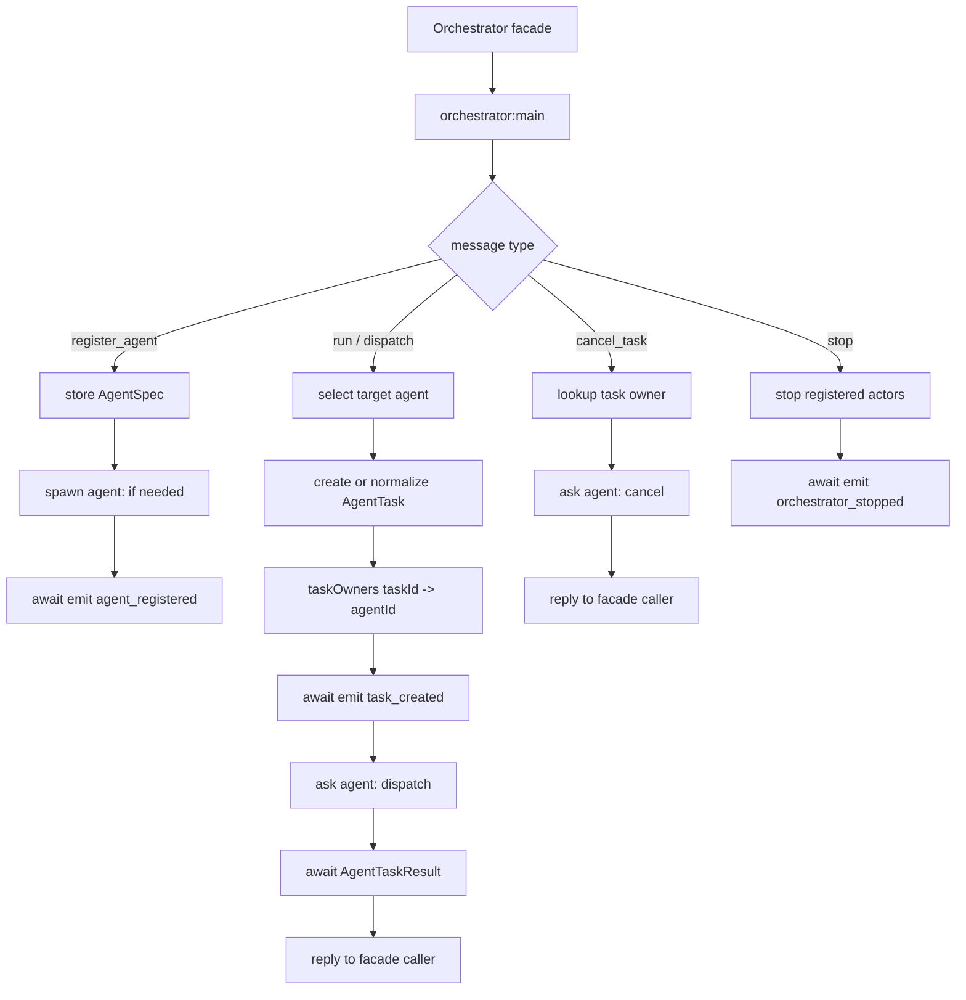
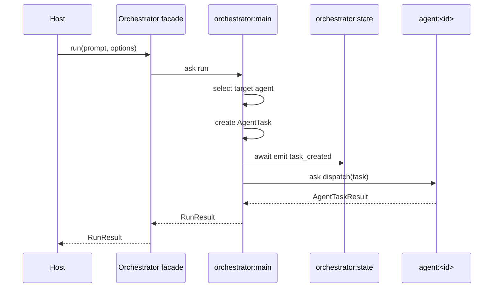
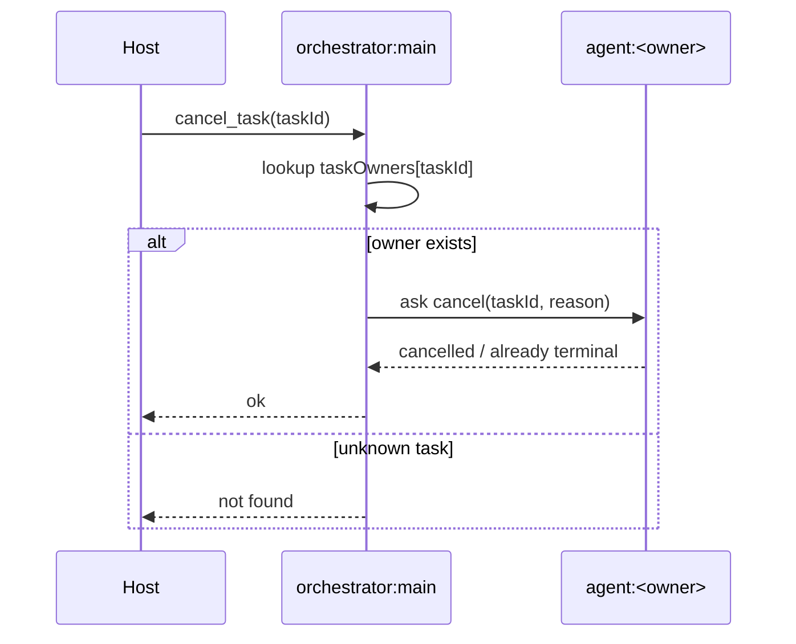
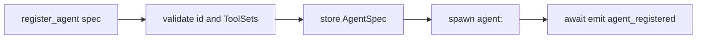

# MainActor

`orchestrator:main` is the root coordinator. It is the only actor that should
understand top-level Orchestrator task routing.

The facade should mostly forward public API calls to MainActor:

```text
run(prompt)          -> ask orchestrator:main run
dispatch(task)       -> ask orchestrator:main dispatch
cancelTask(taskId)   -> ask orchestrator:main cancel_task
registerAgent(spec)  -> ask orchestrator:main register_agent
```

## Role

MainActor owns orchestration-level coordination, not agent execution.

Responsibilities:

- top-level `run()` / `dispatch()` coordination
- target agent selection when omitted
- `taskId -> owning agent` routing
- cancellation routing
- agent registration and unregistration
- infrastructure actor lifecycle coordination
- emitting top-level task creation/registration events

It should not:

- run model steps
- execute tools
- implement Host/TUI approval prompts
- implement concrete ToolProvider internals
- reduce events into state
- inspect or mutate agent transcripts
- decide ToolSet policy

## Private State

```ts
interface MainActorState {
  agents: Map<string, AgentSpec>;
  taskOwners: Map<AgentTaskId, AgentId>;
  defaultAgentId?: AgentId;
  status: "idle" | "running" | "stopping" | "stopped";
}
```

`taskOwners` is the routing table for cancellation and task lookup. It does not
replace StateActor's public task projection.

## Messages

```ts
type MainMsg =
  | { type: "register_agent"; spec: AgentSpec }
  | { type: "unregister_agent"; agentId: string }
  | { type: "dispatch"; task: AgentTask }
  | { type: "run"; prompt: string; options?: RunOptions }
  | { type: "cancel_task"; taskId: string; reason?: string }
  | { type: "stop"; reason?: string };
```

## Core Flow



## Run Sequence



## Dispatch Semantics

`dispatch(task)` is lower-level than `run(prompt)`.

- `run(prompt)` may create an `AgentTask` from prompt/options.
- `dispatch(task)` receives an already shaped task.
- both routes select or validate target agent
- both record `taskOwners`
- both ask the target AgentActor
- both return after the AgentActor returns a terminal result or task id,
  depending on the public API shape

MainActor should not infer tool behavior or inspect model messages while doing
this.

## Cancellation Semantics

Cancellation is routed through `taskOwners`.



AgentActor is responsible for actual task cleanup and terminal task events.
MainActor only routes the cancel request.

## Agent Registration

MainActor owns agent registration because it needs a consistent routing table.



Unregistering an agent should reject or cancel active tasks owned by that agent
before stopping the actor.

## Invariants

- `taskOwners` is updated before asking AgentActor to dispatch.
- `task_created` is emitted before AgentActor emits `task_started`.
- MainActor never mutates AgentActor transcript or model execution state.
- MainActor never executes tools.
- MainActor never reads StateActor snapshot to make routing decisions unless a
  future feature explicitly requires it.
- Every public task operation has one owning agent or returns a clear not-found
  error.
