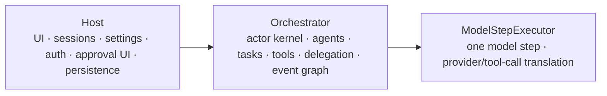
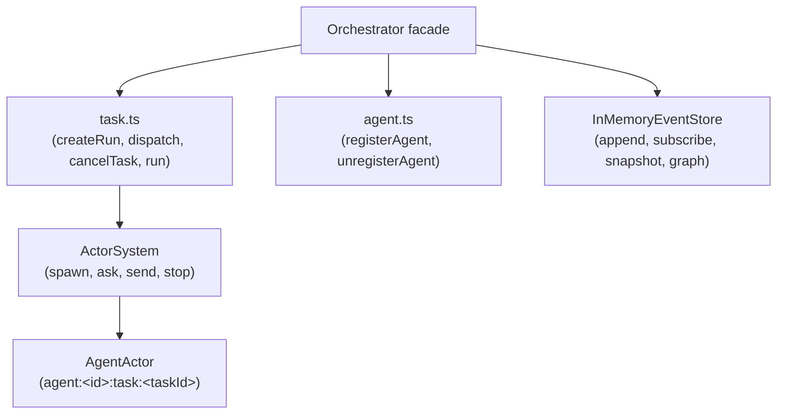

# Orchestrator Architecture



## Principles

- Orchestrator is a runtime, not a Host replacement.
- Task-scoped `AgentActor` instances isolate execution; each registered agent owns
  at most one active task.
- Each actor processes one message at a time.
- Different agents run concurrently through async scheduling.
- Cross-actor coordination goes through messages (send/ask/reply).
- Runtime state is in memory only.
- Public state is managed synchronously by `InMemoryEventStore` (not an actor).
- Actor private state stays private.
- Waiting on tool execution is expressed with `await ToolRegistryImpl.executeTool()`.
- Waiting on subagents is expressed with `await run.resultPromise` (joinTask).

## Facade Boundary

The `Orchestrator` class is the DI root and the public API facade. It holds all
shared services and delegates to helper modules — there are no intermediate
`orchestrator:main` or `orchestrator:state` actors.



The facade may construct dependencies, normalize public API input, and route
to helpers. It does not contain a task scheduler or an actor of its own.

## Component Mapping

| Business concern | Component | Kind | Notes |
| --- | --- | --- | --- |
| Task dispatch, cancel, join, delegate | `task.ts` free functions | Stateless functions | Called directly by facade; agents spawned per task |
| Agent run loop | `AgentActor` | Actor (task-scoped) | ID: `agent:<agentId>:task:<taskId>`; spawned on dispatch, stops after terminal event |
| Task plan updates | `Orchestrator.updatePlan()` → event emission | Facade → event | emits `plan_updated`, picked up by EventStore reducer |
| Tool execution & approval | `ToolRegistryImpl.executeTool()` | Stateless method call | Handles approval gateway, lifecycle events (`tool_execution_start`/`tool_execution_end`) |
| Event ingestion & state | `InMemoryEventStore` | Synchronous class | `append()` is synchronous; no mailbox, no actor |
| Tool discovery | `ToolRegistryImpl.discoverTools()` | Async computation | Iterates ToolSets, discovers from providers, resolves aliases, builds route map |
| Subagent delegation | `orchestrator.delegateToAgent()` / `delegateDetached()` | Facade method | Creates a new task-scoped AgentActor for the subagent |
| Join subtask | `orchestrator.joinTask()` | Facade method | Awaits `run.resultPromise` of a detached task |
| Approval / ask user | `HostToolProvider` | ToolProvider | Host/TUI async bridge via ApprovalGateway promise |
| Agent spec registry | `orchestrator.agentSpecs: Map<string, AgentSpec>` | Facade state | Synchronous lookup/mutation, emits `agent_registered` / `agent_unregistered` |
| Run handle tracking | `orchestrator.runs: Map<string, RunHandle>` | Facade state | Tracks active/recent tasks |
| ToolSet registry | `ToolRegistryImpl.toolSets: Map<string, ToolSet>` | Stateless DI container | Synchronous registry |
| Provider registry | `ToolRegistryImpl.providers: Map<string, ToolProvider>` | Stateless DI container | Providers registered by Host (workspace, host, mcp); orch auto-registered by facade |
| Graph / snapshot | `InMemoryEventStore.graph()` / `.snapshot()` | Pure projection | Derived from accumulated event log; graph returns nodes (agents+tasks) + edges |

Rule of thumb for deciding if something should be an actor:

```text
Can it wait independently or serialize access to private mutable state?
  yes → actor
  no  → plain service/projection/value object
```

## Agent Capability Boundary

Every agent has explicit ToolSets:

```ts
interface AgentSpec {
  id: string;
  toolSetIds: string[];
}
```

`toolSetIds` are the agent's capability boundary. The `AgentActor` calls
`ToolRegistryImpl.discoverTools()` to discover tools for its ToolSets before
each model step. The registry combines provider discovery with ToolSet selection,
aliases, policy, and active tool restrictions.

## Actor Kernel

The `kernel/` layer must not import engine, host, or piko-specific agent types.
Business actors (AgentActor) live above the kernel.

Actor behavior is documented in [actors/](actors/).
