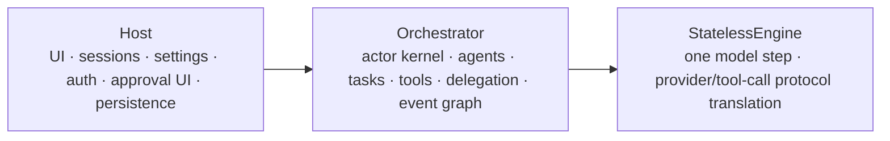

# Orchestrator Architecture

Orchestrator is an actor-first runtime for piko agents. It sits between Host and
StatelessEngine.



## Principles

- Orchestrator is a runtime, not a Host replacement.
- Actors are the unit of isolation, sequencing, and concurrency.
- Each actor processes one message at a time.
- Different actors run concurrently through async scheduling.
- Cross-actor coordination goes through messages.
- Runtime state is in memory only.
- Public state is event-sourced through `StateActor`.
- Actor private state stays private.
- Waiting is expressed with `await ask(...)` and `await emit(...)`.

## Facade Boundary

The Orchestrator facade is a thin adapter around `ActorSystem`.

```mermaid
flowchart TD
  Facade[Orchestrator facade]
  Main[orchestrator:main]
  State[orchestrator:state]

  Facade -->|dispatch(task)| Main
  Facade -->|cancelTask(taskId)| Main
  Facade -->|registerAgent(spec)| Main
  Facade -->|snapshot()| State
```

The facade may construct dependencies, normalize public API input, and route
messages. It should not contain an async task scheduler.

If a facade method starts needing its own state machine, that logic belongs in
an actor.

## Actor Mapping

| Business concern | Actor? | Owner | Reason |
| --- | --- | --- | --- |
| Public run/task coordination | Yes | `MainActor` | Owns top-level run lifecycle, task routing, cancellation routing |
| Agent run loop | Yes | `AgentActor` | Has private transcript/state, awaits engine/tool/subagent work |
| Tool execution bridge | Yes | `ToolActor` | Applies policy, awaits execution, emits lifecycle |
| Timers/watches | Yes | `TimerActor` / `WatchActor` | Waits on time or file/process signals and wakes agents |
| Event reducer / event log | Yes | `StateActor` | Global ordered critical section for business facts |
| Subagent delegation | No separate primitive | Target `AgentActor` | Delegation is `ask("agent:<id>", dispatch)` |
| Approval / ask user | No core actor | `HostToolProvider` | Host/TUI async bridge; pause/resume through provider promise |
| File write serialization | No Orchestrator concern | Concrete write tools/providers | Implementation detail inside write-capable tools |
| Agent registry | No | Main/facade-owned config | Synchronous lookup/config |
| ToolSet registry | Yes | `ToolActor` | Capability boundary and policy used during tool discovery |
| Graph renderer | No | Projection helper used by StateActor | Derived from state/events |

Rule of thumb:

```text
Can it wait independently or serialize access to private mutable state?
  yes -> actor
  no  -> plain service/projection/value object
```

This rule applies to Orchestrator-owned runtime concerns. Serialization inside a
concrete provider, such as a file writer protecting its own writes, remains a
provider implementation detail unless it needs Orchestrator-level visibility or
coordination.

## Source Layout

```text
packages/orchestrator
  kernel/
    actor-system.ts      Generic actor kernel
    mailbox.ts           Async mailbox with close/backpressure
    envelope.ts          Message metadata and correlation IDs
    errors.ts            Runtime errors and ask timeout errors

  actors/
    main.ts             MainActor / root coordinator
    state.ts            StateActor / event reducer owner
    agent.ts             AgentActor
    tool.ts              ToolActor or tool execution bridge
    timer.ts             Optional timer/watch actor

  orchestration/
    orchestrator.ts      Public Orchestrator facade
    events.ts            Event types
    state.ts             Pure reducer and graph projection helpers
    registry.ts          Shared registry helpers if needed
```

The `kernel/` layer must not import engine, host, or piko-specific agent types.

Actor behavior is documented in [actors/](actors/).

## Agent Capability Boundary

Every agent has explicit ToolSets:

```ts
interface AgentSpec {
  id: string;
  toolSetIds: string[];
}
```

`toolSetIds` are the agent's capability boundary. AgentActor asks ToolActor to
discover tools for its own ToolSets before each engine step. ToolActor combines
provider discovery with ToolSet selection, aliases, policy, and active tool
restrictions.
