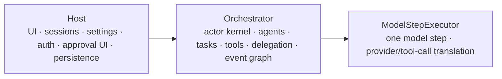
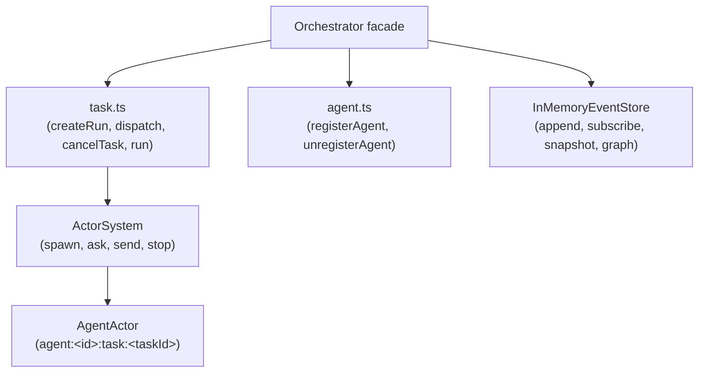

# Orchestrator Architecture



## Principles

- Orchestrator is a runtime, not a Host replacement.
- AgentActors are the unit of task isolation, sequencing, and concurrency.
- Each actor processes one message at a time.
- Different actors run concurrently through async scheduling.
- Cross-actor coordination goes through messages (send/ask/reply).
- Runtime state is in memory only.
- Public state is managed synchronously by `InMemoryEventStore` (not an actor).
- Actor private state stays private.
- Waiting on tool execution is expressed with `await ToolRegistryImpl.executeTool()`.
- Waiting on subagents is expressed with `await run.resultPromise` (joinTask).

## Facade Boundary

The `Orchestrator` class is the DI root and the public API facade. It holds all
shared services and delegates to helper modules — there are no intermediate
`orchestrator:main` or `orchestrator:state` actors.



The facade may construct dependencies, normalize public API input, and route
to helpers. It does not contain a task scheduler or an actor of its own.

## Component Mapping

| Business concern | Component | Kind | Notes |
| --- | --- | --- | --- |
| Task dispatch, cancel, join | `task.ts` free functions | Stateless functions | Called directly by facade; actors spawned per task |
| Agent run loop | `AgentActor` | Actor (task-scoped) | ID: `agent:<agentId>:task:<taskId>`; spawned on dispatch, stops after terminal event |
| Tool execution & approval | `ToolRegistryImpl.executeTool()` | Stateless method call | Handles policy, approval gateway, lifecycle events |
| Event ingestion & state | `InMemoryEventStore` | Synchronous class | `append()` is synchronous; no mailbox |
| Tool discovery | `ToolRegistryImpl.discoverTools()` | Synchronous computation | Pure over registered providers + toolSets |
| Subagent delegation | `OrchToolProvider` → `orchestrator.delegateToAgent()` | Tool + facade method | Creates a new task-scoped AgentActor for the subagent |
| Approval / ask user | `HostToolProvider` | ToolProvider | Host/TUI async bridge via provider promise |
| File write serialization | Concrete write tools/providers | Provider impl detail | Not an Orchestrator concern |
| Agent spec registry | `ctx.agentSpecs: Map` | Facade state | Synchronous lookup/config |
| ToolSet registry | `ToolRegistryImpl` | Stateless DI container | Synchronous capability registry and execution |
| Graph / snapshot | `InMemoryEventStore.graph()` / `.snapshot()` | Pure projection | Derived from accumulated event log |

Rule of thumb for deciding if something should be an actor:

```text
Can it wait independently or serialize access to private mutable state?
  yes → actor
  no  → plain service/projection/value object
```

## Agent Capability Boundary

Every agent has explicit ToolSets:

```ts
interface AgentSpec {
  id: string;
  toolSetIds: string[];
}
```

`toolSetIds` are the agent's capability boundary. The `AgentActor` calls
`ToolRegistryImpl.discoverTools()` to discover tools for its ToolSets before
each model step. The registry combines provider discovery with ToolSet selection,
aliases, policy, and active tool restrictions.

## Actor Kernel

The `kernel/` layer must not import engine, host, or piko-specific agent types.
Business actors (AgentActor) live above the kernel.

Actor behavior is documented in [actors/](actors/).
