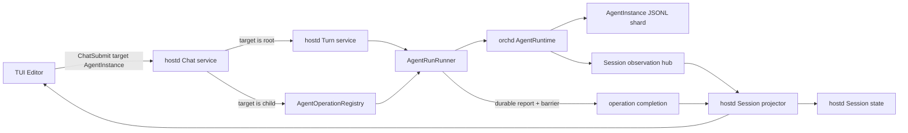

# Agent-Directed Chat Architecture

> Status: implemented architecture
>
> Feature contract: [Agent-Directed Chat](../features/agent-directed-chat.md)
>
> Normative runtime constraints:
> [Turn–Agent Run Boundary](../../../../docs/turn-agent-run-boundary-design.md) and
> [Multi-Agent Runtime Model](../../../../docs/multi-agent-execution-model.md)

## 1. Purpose

When the user submits text from the Editor, the message must be delivered to
the concrete AgentInstance currently selected in AgentPanel. The root
AgentInstance retains the existing Interaction Turn behavior. A child
AgentInstance receives a direct Agent input and starts an Agent run without
creating or completing a root Turn.

This design makes targeted chat a first-class hostd use case. It does not
model child chat as a special TUI shortcut, reuse an Execution identity, or
infer persistence from whichever transcript happens to be visible when a
message commits.

## 2. Goals

1. Capture the selected AgentInstance as the immutable recipient at submit
   time.
2. Preserve the one root Turn to one root Agent run invariant.
3. Keep AgentInstance transcripts durable and independent from TUI view state.
4. Support concurrent runs for different AgentInstances in one Session while
   preserving one active run per AgentInstance.
5. Give every attached Session one reliable observation and projection path.
6. Keep Agent lifecycle/activity authoritative in hostd and AgentRuntime rather
   than synthesizing it in TUI.
7. Make reservation, startup, completion, observation, and cleanup safe under
   concurrency, disconnects, and partial failures.

## 3. Non-goals

- A child Agent run is not an Interaction Turn.
- A child Agent run does not enter the root follow-up queue or trigger root
  compaction.
- The feature does not automatically reopen a closed AgentInstance.
- One Editor submission cannot target multiple AgentInstances.
- No public API exposes or accepts an internal Execution ID.
- This design does not introduce shared mutable transcripts between Agents.
- The first UI version does not need a child-run cancellation shortcut, though
  the control boundary must permit one later.

## 4. Concepts

### 4.1 Chat submission

A ChatSubmission is a user intent addressed by:

```text
session_id + target_agent_instance_id + message
```

It is accepted by hostd. The TUI does not decide which runtime API or lifecycle
applies.

### 4.2 Root Turn operation

If the target is the Session root AgentInstance, hostd starts or queues the
existing Interaction Turn. The Turn owns its public lifecycle, prompt resource
snapshot, follow-up queue, compaction, steering, and cancellation behavior.

### 4.3 Direct Agent operation

If the target is a non-root AgentInstance, hostd starts one direct Agent run
through AgentRuntime. The operation has a host-generated `agent_run_id` for UI
correlation, but the AgentInstance remains the runtime address and the durable
AgentRunReport remains terminal authority.

### 4.4 Session observation scope

An attached Session owns one long-lived observation scope. It multiplexes
reliable committed events and best-effort realtime deltas for every
AgentInstance in that Session. Individual commands do not install, replace, or
own the Session's event sender.

### 4.5 Agent operation lease

An AgentOperationLease is a generation-checked reservation for:

```text
session_id + agent_instance_id
```

It is acquired atomically before asynchronous startup and released exactly
once after terminal projection or startup failure. Dropping or aborting a
startup path also releases the matching generation.

## 5. Ownership

| State or decision | Owner | Authority |
|---|---|---|
| Highlighted Agent in the current frame | TUI | presentation state |
| Persisted selected Agent view | hostd Session state | session repository |
| Submission target after acceptance | hostd | immutable ChatSubmission |
| Root Turn lifecycle | hostd | durable Turn state |
| Agent lifecycle and activity | AgentRuntime, projected by hostd | durable Agent commands plus live activity |
| Agent run terminal result | AgentActor | durable AgentRunReport |
| Agent transcript | AgentInstance shard | append-only JSONL |
| Active operation reservation | hostd runtime adapter | AgentOperationRegistry |
| Session observation cursor | hostd observation service | reliable Session output |
| Realtime draft | TUI | disposable projection |

hostd is the sole authority for user-visible Session state. TUI selection may
initiate a view-change command, but TUI state is never consulted later to
decide where an already accepted message is stored.

## 6. Architectural shape



The important separation is:

- commands start operations;
- AgentRuntime produces durable facts;
- the Session projector observes those facts;
- completion waits for projection through a cursor barrier;
- neither observation nor TUI state establishes the Agent run result.

## 7. Protocol

### 7.1 Submission command

The client-facing command should be target-oriented for both root and child:

```rust
ChatSubmit {
    command_id: CommandId,
    session_id: SessionId,
    target_agent_instance_id: AgentInstanceId,
    text: String,
}
```

hostd loads the authoritative Session manifest and resolves whether the target
is the root. The TUI must not route by display name, AgentSpec ID, parent
presence, or inferred hierarchy.

`ChatSubmit` is the only client-facing chat submission command. Root Turn and
direct Agent input are internal hostd domain operations, not alternate wire
commands.

### 7.2 Acceptance

After validation and operation reservation, hostd emits one successful empty
command response. The authoritative operation identity and state then arrive
through `TurnLifecycle` for the root or `AgentRunLifecycle` for a child. A
queued root submission is acknowledged before its queue projection.

Acceptance freezes the target. Changing AgentPanel selection afterward affects
only the visible Timeline.

### 7.3 Lifecycle events

Root submissions continue to use `TurnLifecycle`.

Direct submissions use a distinct operation lifecycle:

```text
AgentRunLifecycle::Started
AgentRunLifecycle::Completed
AgentRunLifecycle::Failed
AgentRunLifecycle::Cancelled
```

These events describe the user-requested operation, not the AgentInstance's
activity. TUI must derive Agent status only from authoritative `AgentChanged`
events or reconciliation snapshots.

### 7.4 View selection

Selecting an Agent sends or extends a hostd view command with the concrete
AgentInstance ID. hostd persists the selection only after validating that the
Agent belongs to the Session. Transcript subscription and view persistence may
share a command, but they are separate effects:

```text
select view -> persist selection
subscribe view -> replay that Agent's projected timeline
```

## 8. Host application flow

### 8.1 Submit

The Chat service performs these steps:

1. Load the Session and validate target membership.
2. Reject an empty message or an unavailable/terminated target.
3. Capture `target_agent_instance_id` in the accepted request.
4. If target is root, delegate to the existing Turn service.
5. If target is non-root, atomically reserve an AgentOperationLease.
6. Emit command acceptance only after reservation succeeds.
7. Start the Agent run through the runner port.
8. Track completion independently from Session observation.

Root queue policy remains unchanged. A busy child returns an explicit busy
error in the initial product behavior; it is not silently redirected or added
to the root queue.

### 8.2 Complete

When `run_agent` resolves, the runner captures the reliable Session cursor as
an observation barrier. hostd waits until the Session projector has applied
that barrier, then emits the direct operation terminal event and releases the
lease.

The AgentRunReport determines success, failure, or cancellation. Missing or
delayed realtime deltas never affect the terminal result.

### 8.3 Cleanup

Cleanup is represented by the AgentOperationLease, not an acknowledgement
method with placeholder cursor arguments. It must cover:

- validation failure after reservation;
- Session attach failure;
- AgentRuntime rejection;
- completion receiver loss;
- projector failure;
- normal terminal completion;
- stale completion from an older generation.

Only the matching generation may release an active operation.

## 9. Operation registry and concurrency

The registry is one atomic map keyed by Agent address:

```rust
type AgentAddress = (SessionId, AgentInstanceId);

struct ActiveAgentOperation {
    generation: OperationId,
    kind: RootTurn | DirectAgentRun,
    phase: Reserved | Starting | Running | Completing,
}
```

Reservation uses one lock acquisition or one actor mailbox transaction. There
is no separate `contains` check followed by an asynchronous insertion.

Required behavior:

| Existing work | New work | Result |
|---|---|---|
| root running | root submission | existing root queue policy |
| root running | idle child submission | allowed |
| child A running | child A submission | busy error |
| child A running | child B submission | allowed |
| child running | root submission | allowed if root is idle |
| target closed | direct submission | closed error |

AgentRuntime remains the final enforcement point for the invariant that one
AgentActor has at most one active internal run. The host registry prevents
duplicate user operations and owns UI-correlated lifecycle.

## 10. Session attachment and event routing

### 10.1 Attach once

The runner keeps one SessionRuntimeScope per attached Session:

```rust
struct SessionRuntimeScope {
    session_id: SessionId,
    durable_commit: Arc<dyn ExecutionCommitPort>,
    observation_hub: Arc<SessionOutputHub>,
    projector_handle: ProjectorHandle,
    generation: SessionGeneration,
}
```

Attaching recovers every AgentInstance and installs commit, realtime, approval,
interaction, and Agent projection ports once. Starting a new Turn or direct
Agent run reuses this scope.

`SessionOutputHub` is a production runtime abstraction. It must not be exposed
from a `testing` module.

### 10.2 Session-scoped routing

All event routing is keyed by `session_id`. There is no global mutable
`Option<Sender>` that the latest command can replace.

Reliable observation includes enough information to project:

- committed transcript messages and tools;
- Agent lifecycle/activity changes derived from durable Agent commands;
- approval and user-interaction lifecycle;
- the cursor required by completion barriers.

Realtime deltas are multiplexed by `session_id + agent_instance_id +
message_id`. A direct run does not install a new realtime router or clear a
router owned by another Agent operation.

### 10.3 One projector

One Session projector consumes the observation stream regardless of which
command started the work. It handles replay, retention exhaustion, durable
reconciliation, and cursor advancement uniformly for root and child runs.

The projector publishes its applied cursor through a watch channel or
watermark API:

```text
wait_until_applied(observation_barrier)
```

This removes per-command copies of the observation loop and guarantees that a
terminal Agent status change is applied before an operation terminal event.

## 11. Persistence and resume

### 11.1 Transcript durability

Every accepted input and generated response is committed to:

```text
agents/<target_agent_instance_id>.jsonl
```

Transcript durability does not depend on:

- the currently visible Agent when commit occurs;
- the global Session tree leaf;
- whether the TUI remains connected;
- whether the target is root or child.

Session recovery loads every AgentInstance shard and rebuilds each Agent view
from its own transcript.

### 11.2 View persistence

Persist view selection explicitly, for example:

```rust
SessionViewSelection {
    agent_instance_id: AgentInstanceId,
    selected_message_id: Option<MessageId>,
}
```

`selected_message_id`, when present, must belong to the selected Agent's
transcript. Per-Agent transcript heads are derived from their shards and are
not inferred from one global `currentLeafId`.

A message commit never changes the selected Agent. An explicit AgentPanel
selection changes it. Therefore:

- submit to child, remain on child -> resume on child with new messages;
- submit to child, switch to root before completion -> resume on root, while
  the child transcript still contains the new messages;
- reopen and select child -> replay the complete child transcript.

This separates persistence correctness from presentation state and removes the
need to scan shards to guess which Agent owns a global leaf.

## 12. TUI behavior

TUI captures the highlighted concrete AgentInstance ID when Enter is handled
and sends one `ChatSubmit`. It does not inspect `parent_agent_instance_id` to
select a protocol path.

TUI maintains pending submissions by command or operation ID. It may show an
operation spinner for the targeted Agent, but it does not write authoritative
Agent activity/status locally. `AgentChanged` and reconciliation snapshots are
the only sources for those fields.

Timeline filtering is based on each event's AgentInstance ID. Switching views
does not discard committed events for non-visible Agents; they remain in the
per-Agent timeline cache and durable host projection.

No layout, slot, focus, or Editor keybinding changes are required.

## 13. Failure and recovery behavior

| Failure | Required result |
|---|---|
| Target missing from Session | reject before acceptance |
| Target closed/unavailable | explicit error; no fallback to root |
| Same Agent already running | busy error or root queue policy |
| Different Agent running | allow independent start |
| Runtime rejects after reservation | fail operation and release matching lease |
| Observation disconnect | reconnect/replay; Agent run continues |
| Retention exhausted | rebuild projection from durable shards |
| TUI disconnects | Agent run and persistence continue |
| Completion arrives before final events | wait for projector barrier |
| hostd restarts after durable report | recover transcript/report and converge without rerun |
| Stale cleanup arrives | generation mismatch; leave newer operation intact |

## 14. Port design

The host runner port should express one Agent-level operation and specialize
only the root Turn binding:

```rust
trait AgentRunRunner {
    async fn ensure_session_attached(
        session: SessionAttachment,
    ) -> Result<SessionRuntimeHandle>;

    async fn run_agent(
        input: AgentRunInput,
    ) -> Result<AgentRunHandle>;

    async fn cancel_agent_run(
        session_id: SessionId,
        agent_instance_id: AgentInstanceId,
        operation_id: OperationId,
    ) -> Result<CancelReceipt>;
}
```

`AgentRunHandle` contains the completion receiver and operation identity. It
does not own a second Session subscription. Observation belongs to
`SessionRuntimeHandle` and the Session projector.

The Turn service wraps `run_agent` with Turn start/terminal state, prompt
resources, queue, compaction, and root-only policy. The direct Chat service
uses the same runner without creating a Turn.

## 15. Invariants

1. Every submission is addressed by `session_id + agent_instance_id`.
2. The accepted target never changes when TUI selection changes.
3. Only root-targeted submissions create Interaction Turns.
4. One AgentInstance has at most one active run; different Agents may run
   concurrently.
5. AgentRunReport is the only Agent run terminal authority.
6. Observation orders projection but never determines business success.
7. Every attached Session has one observation scope and one projector.
8. Event senders and realtime routes are session-scoped, never globally
   replaceable by the latest command.
9. Agent status is projected from AgentRuntime facts, never synthesized from
   command lifecycle in TUI.
10. Transcript durability is independent from current view selection.
11. View selection is explicit persisted state, not inferred from transcript
    ownership.
12. Operation reservation and release are atomic and generation-checked.
13. No product command, event, or control path exposes Execution identity.

## 16. Verification

Required tests:

1. Root target enters the Turn path; child target never creates a Turn.
2. Changing selection after acceptance does not redirect committed messages.
3. Child messages survive close/reopen regardless of the selected Agent at
   commit time.
4. Persisted view selection restores independently from transcript heads.
5. Two simultaneous submissions to one Agent yield one accepted operation.
6. Different child Agents in one Session may run concurrently without event
   loss or router replacement.
7. Two Sessions running concurrently receive only their own AgentChanged,
   transcript, realtime, approval, and interaction events.
8. Completion waits until final message and terminal Agent projection pass the
   observation barrier.
9. Observation disconnect and retention exhaustion converge from durable
   state without restarting the Agent run.
10. Startup failure and stale completion release only the matching operation
    generation.
11. TUI never changes Agent activity/status from AgentRunLifecycle alone.
12. No Session recovery path chooses transcript durability by scanning for the
    owner of a global leaf.

## 17. Implementation realization

- The wire protocol exposes only target-oriented `ChatSubmit`.
- hostd resolves root versus child from the authoritative Session manifest.
- Agent operations are atomically reserved by Session and AgentInstance, with
  generation-checked cleanup.
- Session event and realtime routing are scoped by Session and AgentInstance;
  concurrent operations cannot replace each other's senders.
- Root and direct operations use the same recoverable observation driver and
  cursor-barrier completion rule.
- Agent transcripts and selected view are persisted independently.
- TUI submits the concrete viewed AgentInstance and treats host projections as
  authoritative for Agent activity.

The root Turn service and direct Agent service remain separate internal domain
policies. Their separation is intentional and is not exposed as protocol
compatibility surface.
