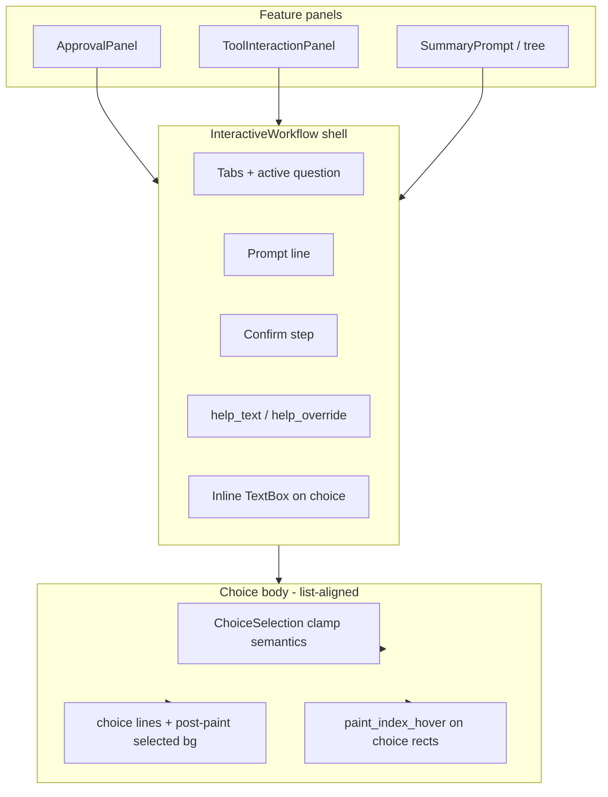
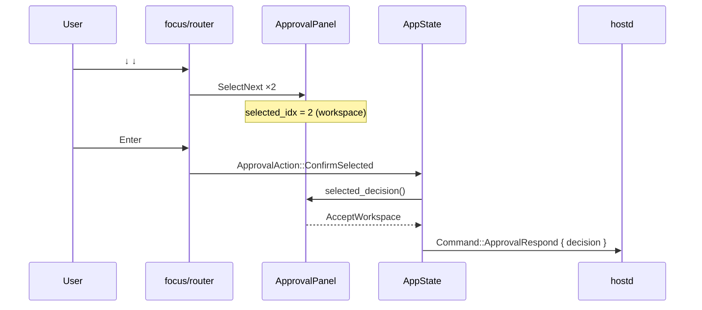

# Decide Surfaces UX Redesign (Approval + Ask User)

| Field | Value |
|-------|--------|
| **Status** | Draft |
| **Author** | (TBD) |
| **Date** | 2026-08-10 |
| **Package** | `piko-tui` |
| **Type** | Package-local implementation design |
| **Intended repo home (after approval)** | Design: `packages/tui/docs/design/decide-surfaces-ux.md` (new); Feature PRD update: `packages/tui/docs/features/tool-interactive-workflow.md` (+ optional Approval UX section / cross-link) |
| **Supersedes / refines** | Interaction contract for Approval + Tool Interaction consumers of `InteractiveWorkflow`; does not replace hostd/orchd interaction protocol design |
| **Related** | `packages/tui/docs/features/component-feedback.md`, `component-interaction.md`, `dock-coexistence.md`; `packages/tui/docs/design/tool-interactive-workflow.md` |

---

## Overview

Approval (`SurfaceId::Approval`) and Ask User / Tool Interaction (`SurfaceId::ToolInteraction`) are the two **Decide** surfaces that share the Interactive Workflow visual pattern: a blocking ComposerBand dock that replaces the editor while the host waits for a structured decision. Today they share `InteractiveWorkflow` paint and pointer geometry, but **not** the same keyboard / selection contract. Approval looks like a navigable choice list while remaining letter-shortcut-only (Enter always “Accept once”); its selection cannot persist because `ApprovalPanel::workflow()` rebuilds a fresh workflow every render. Tool Interaction already owns a durable `InteractiveWorkflow` and correctly wires ↑/↓ / Enter / Tab.

This design unifies both surfaces under one **Decide language** (↑/↓ select, Enter confirm selected target, Esc cancel/decline, hover preview, click = keyboard confirm). Approval drops letter shortcuts (`a`/`w`/`p`); scoped grants are chosen only by list selection + Enter (or click). Ask User keeps multi-question tabs, optional confirm, and inline text on choices. The recommended approach is **Option A**: keep a thin Interactive Workflow shell for tabs / prompt / confirm / inline input / help-override, and for the choice body reuse **list feedback helpers + unfiltered clamp selection semantics**—without embedding `SelectableList<T>`, without list filter/panel chrome, and without rewriting Decide surfaces as SelectableList panels.

**No protocol change.** Security boundaries stay: Approval → `Command::ApprovalRespond`; Ask User → `Command::UserInteractionRespond`. hostd remains authoritative for durable pending state; TUI owns only ephemeral UI selection and focus.

---

## Background & Motivation

### Current architecture (verified in code)

```text
                    SurfaceIntent::Dock (ComposerBand, OutsideClickPolicy::Block)
                    ┌─────────────────────────────────────────────────────────┐
 ApprovalPanel ───► │ InteractiveWorkflow (ephemeral rebuild in workflow())   │
                    │   choices painted custom; hover custom                  │
 ToolInteraction ─► │ InteractiveWorkflow (owned by PendingInteraction)       │
                    │   ↑↓/Tab/Enter wired; selection durable                 │
 SummaryPrompt ───► │ InteractiveWorkflow (tree footer embed; choice-nav bug) │
                    └─────────────────────────────────────────────────────────┘
                              ≠ SelectableList surface
                    SelectableList used by Models / Sessions / Settings / …
```

| Concern | Location | Today |
|---------|----------|--------|
| Shared workflow component | `packages/tui/src/ui/components/interactive_workflow.rs` (+ `pointer.rs`) | Custom body paint, custom hover, choice selection state on `Question.selected_idx` |
| Approval feature | `packages/tui/src/features/approval/mod.rs` | Queue of `PendingApproval`; `workflow()` builds a **new** `InteractiveWorkflow` each call |
| Tool Interaction feature | `packages/tui/src/features/tool_interaction/mod.rs` | Queue of `PendingInteraction` owning durable `workflow: InteractiveWorkflow` |
| Focus keys | `packages/tui/src/input/focus/router.rs` | Approval: letter shortcuts + Enter→Accept + Esc→Decline; **no** ↑/↓. ToolInteraction: full nav |
| Actions | `packages/tui/src/app/command.rs`, `dispatch/actions.rs`, `turn.rs` | `ApprovalAction::Respond` only; rich `ToolInteractionAction::{SelectNext,SelectPrev,Choice,…}` |
| Dock budget | `packages/tui/src/layout/mod.rs` + `navigation/select_band.rs` | `SelectBandBudget::standard_info(workflow.dock_content_rows(theme))` |
| List layers | `ui/components/selectable_list/` + `feedback.rs` | **Kernel** `SelectableList<T>` (items + selected + filter); **paint/panel** (List/Table body, search chrome); **feedback** (`selection_prefix`, `with_selected_bg`, `paint_index_hover`) |
| Feedback PRD | `docs/features/component-feedback.md` | Choice workflow must use same Selected/Hover/Enter language as List |

### Pain points (verified)

1. **InteractiveWorkflow does not share list feedback.** Choice rows use `selection_prefix` + accent/bold text, not list Selected tokens (`text`+bold, optional full-row `bg_selected`). Hover is a private region pass, not `paint_index_hover`.

2. **Approval selection never persists.** `ApprovalPanel::workflow()` constructs a fresh `InteractiveWorkflow` on every call (`render`, `component_regions`, dock budget). `selected_idx` always starts at `0`. There is no place to store keyboard selection on the panel.

3. **Approval keyboard is letter-only; list is cosmetic.** Router maps Enter → always `ApprovalDecision::Accept`, not “confirm selected row.” ↑/↓ are not handled. The UI paints `❯` on choice 0 and looks navigable, violating the feedback contract (“Selected = next Enter target”).

4. **Tool Interaction is mostly correct** for multi-question, digits, Tab, Enter (advance / inline / submit), Esc cancel, and pointer click = select + submit.

5. **SummaryPrompt choice navigation is wrong for all SelectNext/Prev chords.** Router maps Up/Left/BackTab → `SelectPrev` and Down/Right/Tab → `SelectNext`, but `select_surface_next` / `select_surface_prev` call `workflow.next_step()` / `prev_step()` instead of `select_next()` / `select_prev()`. That breaks every choice-nav chord, not only arrows.

6. **Dual geometry paths** (`body_lines` for paint/dock height vs `rows_in` for hits/hover/input origin) already exist; choice prefix width for `input_field_origin_in` is hard-coded and will drift if row layout changes.

7. **component-feedback** requires list-like Selected/Hover/Enter for workflow choices; Approval currently fails Enter semantics; PRDs still specify accent-selected choice text (must be reconciled in PR1).

8. **Dock layout** is already correct in structure (Decide = `SurfaceIntent::Dock` replacing composer); redesign must keep `dock_content_rows` + `SelectBandBudget::standard_info` working.

---

## Goals & Non-Goals

### Goals

- One consistent **Decide language** for Approval and Ask User:
  - ↑/↓ (and equivalent) move choice selection
  - Enter confirms the **selected** decision / advances workflow per existing Ask User rules
  - Esc cancels / declines (surface-specific outcome)
  - Hover previews non-selected targets; click activates like keyboard confirm for that target
- Approval is **list-only** for grants: ↑/↓ (or click) + Enter confirm selected; Esc declines. No `a`/`w`/`p` letter shortcuts. Default idx 0 = Accept once.
- Persist Approval selection in panel-owned state for the front pending request.
- Ask User retains multi-question tabs, optional `require_confirm` Submit step, optional inline text on choices, digit shortcuts `1`…`n`.
- **Normative list-aligned Selected** on choice rows (and confirm row): caret accent optional, label `text`+bold, full-row optional `bg_selected`; warning/accent reserved for Decide chrome (title, prompt, tabs).
- Dock height continues to follow content via `dock_content_rows` → `SelectBandBudget::standard_info`.
- Single geometry builder for paint, hit regions, dock height, and inline-input origin.
- TUI-only redesign; hostd authoritative; no protocol DTO changes unless a hard blocker appears (none expected).
- Keep security boundary: ApprovalRespond vs UserInteractionRespond.
- Fix SummaryPrompt choice navigation for **all** SelectNext/Prev key chords (no tree product expansion).

### Non-Goals

- Merging Approval and Tool Interaction into one surface id or one hostd command.
- Making Decide surfaces into filterable SelectableList browse panels (no search row).
- Embedding `SelectableList<T>` or adopting filter/`selectable_row_regions` list viewport for choice bodies.
- Reworking tree product UX beyond SummaryPrompt using the same choice-list interaction contract.
- Changing approval grant semantics (once / session / workspace / permanent / decline) or hostd persistence rules.
- Pointer drag / multi-select / custom widgets from tools.
- Splitting InteractiveWorkflow into a full Mini-App framework.
- Approval digit shortcuts in the behavior PR (deferred to PR5).

---

## Primary design question: SelectableList reuse

### Three layers (do not conflate)

| Layer | What it is | Reuse for Decide? |
|-------|------------|-------------------|
| **Feedback helpers** | `feedback.rs`: `selection_prefix`, `row_primary_style`, `selected_bg` / `with_selected_bg`, `hover_bg`; `paint_index_hover` | **Yes** — choice + confirm rows |
| **Kernel type** | `SelectableList<T>`: items + selected + **filter-aware** `select_next`/`select_prev`, wrap variants | **No type required** — match **unfiltered clamp** semantics only (thin `ChoiceSelection` or `usize` mutators) |
| **Panel / paint body** | Minimal/Standard pane + search + `selectable_row_regions` viewport + Stacked/Columns/Settings strategies | **No** — workflow owns chrome and body layout |

### Capability matrix

| Need | SelectableList today | InteractiveWorkflow today | Fit |
|------|----------------------|---------------------------|-----|
| Selected index + clamp ↑/↓ | Kernel (filter-aware) | `Question.selected_idx` + clamp | Match unfiltered clamp; no filter |
| Wraparound | `select_*_wrapped` | No wrap | No wrap for Decide |
| Filter / search row | Panel chrome | N/A | **Do not adopt** |
| Stacked / Columns / Settings paint | Panel body strategies | Numbered choice + optional inline text | **Do not adopt** full strategies; feedback tokens only |
| Tabs / multi-question | No | Yes | Workflow shell |
| Confirm step | No | Yes | Workflow shell |
| Inline text on selected choice | No | Yes | Workflow shell |
| help_override | No | Yes | Workflow shell |
| Hover | `paint_index_hover` (index regions) | Private full-HitId hover | Choice indices → shared helper; Tab/Submit separate |
| Hit regions | `selectable_row_regions` (list viewport) | `rows_in` body geometry | Workflow geometry builder owns all |
| Dock Fixed content budget | List budgets elsewhere | `dock_content_rows` = body height | Keep Fixed standard_info |
| Digit / letter shortcuts | Not in kernel | Digits optional (Ask User); **no** Approval letter shortcuts | Feature/router |

### Options

| Option | Description | Pros | Cons |
|--------|-------------|------|------|
| **A. Shell + list feedback + clamp semantics for choice body** | Feedback helpers + clamp selection; shell owns tabs/prompt/confirm/input/help | Minimal churn; fixes Approval; matches feedback PRD; preserves multi-question | Shell + body must share one geometry builder |
| **B. Full rewrite as SelectableList surface** | Each Decide surface becomes a SelectableList panel | One panel type | Tabs, confirm, inline input, help_override, Fixed dock body do not fit without bloating list |
| **C. Keep custom paint; only align contract** | Fix keys/state; private paint forever | Smallest early diff | Drift; violates “compose don’t fork” as end state |
| **D. Other** | e.g. new parallel `ChoiceList` crate | Greenfield | Extra component without payoff over A |

### Recommendation: **Option A**

**Share (normative):**

- **List Selected visual language** for choice rows and confirm row (PRD-updated): caret via `selection_prefix` (accent caret optional), selected label via `row_primary_style` (`text`+bold), full-row optional `bg_selected` via post-paint rect pass (see paint strategy), unselected muted.
- **Unfiltered clamp selection semantics** (`select_next` / `select_prev` / `select_index` without wrap). Prefer a thin `ChoiceSelection { selected, len }` or keep `usize` mutators on `Question` / `PendingApproval`. **Do not** embed `SelectableList<T>` or call filter-taking kernel methods with dummy filters.
- **Hover for choices:** `paint_index_hover` with choice-only `[(Rect, usize)]`.

**Do not share (workflow-owned):**

- Multi-question tabs and `goto_step` / `next_step` / `prev_step` / `confirm_focused`.
- Prompt line, blank spacers, confirm body content.
- Inline `TextBox` on a choice and input-active key capture.
- `help_override` and state-derived help line.
- Pane chrome (`render_modal` / embedded `render`) and full `HitId::{Tab,Submit,Choice,TextInput}` region map.
- Mapping selection → domain command (Approval decision vs interaction answers).
- Filter/search, `selectable_row_regions`, Stacked/Columns/Settings panel body strategies.

**Reject B** because SelectableList panel path is a **filterable list overlay** (search, filtered indices, List/Table body). Decide surfaces are **blocking questionnaires** with extra chrome and a non-list confirm step.

**Reject C alone** because without durable Approval selection state and Enter→selected semantics, “aligned language” remains a visual lie. Behavior may ship before paint (PR2 before PR4), but the end state is A, not C.

**Reject hybrid “Approval-only SelectableList + ToolInteraction shell”:** same B problems for Ask User, and splits Decide language across two panel types.

---

## Proposed Design

### Mental model: shell + choice body



### Interaction contract (Decide language)

#### Shared (both surfaces when choice list is focused)

| Input | Behavior |
|-------|----------|
| Down | `select_next` on active question (clamp; no wrap) |
| Up | `select_prev` (clamp) |
| Enter | Confirm **selected** choice semantics (surface-specific; see below) |
| Esc | Surface cancel / decline when not editing inline input |
| Hover non-selected choice | Soft hover bg (`hover_bg`); never overrides keyboard selection |
| Click choice | Select that index **and** same confirm path as Enter for that surface |
| Click empty chrome | No-op (Block outside-click policy on dock) |

#### Approval-specific

| Input | Behavior |
|-------|----------|
| Enter (`KeyCode::Enter` / default Submit fall-through) | Emit `ApprovalAction::ConfirmSelected` → resolve to `selected_decision()` → `Command::ApprovalRespond` |
| Esc (global Cancel + focus path) | Immediate `Respond(Decline)` — **does not** mutate `selected_idx`; selection state is irrelevant after resolve |
| Enter on Decline row (index 4) | Same host decision as Esc: `ApprovalDecision::Decline` |
| Digits `1`…`5` | **Not in PR2.** Deferred to PR5: select-only (no auto-submit). Help text must not advertise digits until PR5. |
| `a` / `w` / `p` (and related `KeyAction::ApprovalAccept*`) | **Removed from product UX.** Implementation removes hard-coded letter routing and default keybindings; no help text. |

**Esc vs Decline-row:** Esc is immediate Decline with no selection mutation required. Selecting Decline then Enter sends the same `ApprovalDecision::Decline` to hostd. No animation parity requirement (no “select then confirm” for Esc).

**Default selection:** index `0` (Accept once) when a new front approval is shown or the front id changes. With default selection, Enter without moving still Accept once (one-key common path).

**Normative `selected_decision()` map** (same as existing `approval_decision`):

| Index | Decision |
|------:|----------|
| 0 | `Accept` (once) |
| 1 | `AcceptSession` |
| 2 | `AcceptWorkspace` |
| 3 | `AcceptPermanent` |
| _ | `Decline` |

**Help line (override) — PR2 (no digits, no letter shortcuts):**

```text
↑↓ select · Enter confirm · Esc decline · tool {name}
```

**Help line after PR5 (if digits land):**

```text
↑↓ select · 1-5 · Enter confirm · Esc decline · tool {name}
```

#### Ask User / Tool Interaction (preserve + document)

| Input | Behavior |
|-------|----------|
| ↑/↓ | Choice nav when not editing input |
| Tab / Shift+Tab (and Left/Right as today) | Question / Submit step navigation |
| Digits `1`…`9` | Select choice by index (no submit) |
| Enter | If input active → save input; else if choice has_input → enter input; else if more steps / require_confirm → advance; else submit |
| Esc | Exit input if active; else `UserInteractionRespond::Cancel` |
| Click choice | Select + Submit action path (existing: `Choice` then `Submit` — keeps one-shot single-question UX) |
| Click tab / Submit | Goto step / submit |

#### SummaryPrompt (consistency only)

| Input | Behavior |
|-------|----------|
| **All** SelectNext/Prev chords: Up, Down, Left, Right, Tab, BackTab | Choice `select_prev` / `select_next` (fix bug for every chord) |
| Enter | Existing `confirm_summary_prompt` |
| Esc | Dismiss prompt |

No step navigation until a multi-step SummaryPrompt product exists; today is single-question, so Tab/Left/Right correctly become choice nav once `select_surface_*` is fixed.

### ASCII mockups

#### Approval — before (broken contract)

```text
┌─ Approval ──────────────────────── tool: exec_command ─────────────────────┐
│                                                                            │
│  Approval: Run command `cargo test -p tui`?                                │
│                                                                            │
│  ❯ 1. Accept once          ← looks selected (accent bold today)            │
│    2. Accept for session                                                   │
│    3. Accept for workspace                                                 │
│    4. Accept permanently                                                   │
│    5. Decline                                                              │
│                                                                            │
│   Enter accept once · A session · W workspace · P permanent · Esc decline  │
└────────────────────────────────────────────────────────────────────────────┘
  ↑/↓: no effect · Enter: always Accept once · selection not stored
```

#### Approval — after

```text
┌─ Approval ──────────────────────── tool: exec_command ─────────────────────┐
│                                                                            │
│  Approval: Run command `cargo test -p tui`?   ← prompt: warning emphasis   │
│                                                                            │
│  ❯ 1. Accept once          ← Selected: caret + text bold + full-row bg*    │
│    2. Accept for session                                                   │
│    3. Accept for workspace                                                 │
│    4. Accept permanently                                                   │
│    5. Decline                                                              │
│                                                                            │
│  ↑↓ select · Enter confirm · Esc decline · tool exec_command               │
└────────────────────────────────────────────────────────────────────────────┘
  * bg_selected when theme provides it (post-paint full choice rect)
  After ↓↓: selection on workspace; Enter → AcceptWorkspace
  Esc always Decline (no need to move to row 5)
  Hover on Decline: hover bg preview; click → Decline (same as select+confirm)
  No a/w/p letter shortcuts — all grants via list + Enter (or click)
```

#### Ask User — single question (after; list-aligned Selected)

```text
┌─ Tool Interaction ─────────────────────────────────────────────────────────┐
│                                                                            │
│  Scope: choose how the agent should continue                               │
│                                                                            │
│  ❯ 1. Use the current file only                                            │
│    2. Search the workspace                                                 │
│    3. Ask me for a custom path: notes…█     ← inline input when active     │
│                                                                            │
│  Enter to select · ↑/↓ to navigate · Esc to cancel                         │
└────────────────────────────────────────────────────────────────────────────┘
```

#### Ask User — multi-question (after)

```text
┌─ Tool Interaction ──────────────────────────────────────── 1/2 ────────────┐
│                                                                            │
│  [Scope]   [Format]   [Submit]      ← active tab accent; inactive muted    │
│                                                                            │
│  Scope: choose how much context to use                                     │
│                                                                            │
│  ❯ 1. Current file                                                         │
│    2. Open buffers                                                         │
│    3. Whole workspace                                                      │
│                                                                            │
│  Enter to select · ↑/↓ choose · Tab switch question · Esc cancel           │
└────────────────────────────────────────────────────────────────────────────┘
```

```text
┌─ Tool Interaction ──────────────────────────────────────── 1/2 ────────────┐
│                                                                            │
│  [Scope]   [Format]   [Submit]      ← Submit tab accent when confirm focus │
│                                                                            │
│  Ready to submit your answers?                                             │
│                                                                            │
│  ❯ [ Confirm ]              ← same Selected treatment as choice rows       │
│                                                                            │
│  Enter to submit · Tab to cycle · Esc to cancel                            │
└────────────────────────────────────────────────────────────────────────────┘
```

### State model

#### ApprovalPanel (migration)

**Before:**

```rust
pub struct PendingApproval { /* id, agent, tool, args, prompt */ }
pub struct ApprovalPanel { pub pending: VecDeque<PendingApproval> }
// workflow() rebuilds InteractiveWorkflow every time
```

**After (recommended):**

```rust
pub struct PendingApproval {
    pub id: String,
    pub agent_instance_id: String,
    pub tool_name: String,
    pub args: serde_json::Value,
    pub prompt: Option<String>,
    /// Keyboard selection among fixed approval choices (0..4).
    pub selected_idx: usize,
}

pub struct ApprovalPanel {
    pub pending: VecDeque<PendingApproval>,
}

impl ApprovalPanel {
    pub fn push(&mut self, mut approval: PendingApproval) {
        approval.selected_idx = 0;
        self.pending.push_back(approval);
    }

    pub fn select_next(&mut self) { /* clamp front.selected_idx */ }
    pub fn select_prev(&mut self) { /* … */ }
    pub fn select_choice(&mut self, idx: usize) { /* … */ }
    pub fn selected_decision(&self) -> Option<ApprovalDecision> {
        // same map as approval_decision(selected_idx)
    }

    /// Ephemeral view model: copies selected_idx into Question for paint/hits.
    pub(crate) fn workflow(&self) -> Option<InteractiveWorkflow> { /* … */ }
}
```

Prefer **selection on `PendingApproval`** + ephemeral `workflow()` that copies `selected_idx` for paint/hit testing. Mutation only via panel methods used by dispatch. Owning a full durable `InteractiveWorkflow` on the front (ToolInteraction-style) is heavier and unnecessary unless Approval grows inline input.

#### ToolInteractionPanel

No structural migration. Optionally migrate `Question.selected_idx` to shared `ChoiceSelection` for one clamp path.

#### InteractiveWorkflow

Keep shell fields:

```rust
pub struct InteractiveWorkflow {
    pub questions: Vec<Question>,
    pub active_question_idx: usize,
    pub require_confirm: bool,
    pub confirm_focused: bool,
    pub target_entry_id: Option<String>, // tree only; optional later cleanup
    pub help_override: Option<String>,
}

pub struct Question {
    pub header: String,
    pub prompt: String,
    pub choices: Vec<ChoiceOption>,
    pub selected_idx: usize, // or ChoiceSelection
    pub input_value: TextBox,
    pub is_input_active: bool,
}
```

Optional thin type (semantics only—not `SelectableList<T>`):

```rust
/// Unfiltered single-column choice selection (clamp; no wrap; no filter).
pub struct ChoiceSelection {
    pub selected: usize,
    pub len: usize,
}
impl ChoiceSelection {
    pub fn select_next(&mut self) { /* clamp at len-1 */ }
    pub fn select_prev(&mut self) { /* clamp at 0 */ }
    pub fn select_index(&mut self, i: usize) -> bool { /* … */ }
}
```

### Geometry: single source of truth

Today paint uses `body_lines` (dock height = `.len()`), while hits/hover/input use `rows_in` and a **hard-coded** input caret X (`2 + width(number) + width(label) + 2` in `pointer.rs`). That dual path is a drift risk when paint changes.

**Current bug (multi-question + confirm) — name it so PR4 does not re-copy it:**

When `confirm_focused`, `rows_in` **early-returns** with `submit_y = inner.y + 2` and **empty `tab_rects`** (`interactive_workflow.rs` ~196–199). Meanwhile `body_lines` still paints multi-question tabs first, then “Ready to submit…”, blank, then `❯ [ Confirm ]` (~275–321). Consequences:

- Confirm hit/hover y is wrong for multi-Q confirm (paint line of Confirm is **not** `inner.y + 2` after tabs + Ready + spacer).
- Tab hit regions disappear while tabs remain painted (tabs not clickable / not hoverable on the Submit step).
- An implementer who ports “same as `rows_in` today” into `layout.rs` will reintroduce this drift while believing the builder is paint-aligned.

**Required layout rule for `confirm_focused`:**

- When `questions.len() > 1`, still emit **full multi-Q tab geometry** (including the Submit tab sentinel when `require_confirm`).
- Place `submit_y` at the **painted Confirm line** (after tabs row + blank + Ready line + blank), not a hard-coded `inner.y + 2`.
- Single-question confirm (no tabs) still places Confirm after its Ready/spacer lines from the same builder—not a special-case y that disagrees with paint.

**Requirement:** one geometry builder (module-private) used by paint, hit regions, hover rects, dock height authority, and input origin:

```text
WorkflowLayout / build_layout(inner, state)
  ├── content_line_count     → dock_content_rows (if body_lines remains authority, layout must match)
  ├── tab_rects              → still populated when confirm_focused && multi-Q
  ├── prompt_y / spacer rules
  ├── choice_rows: Vec<{ y, index }>  → empty when confirm_focused
  ├── submit_y               → y of painted Confirm line (not inner.y+2 early-return)
  ├── choice_prefix_width(index)  → caret + "N. " widths from same constants as paint
  └── input_origin(choice) = (inner.x + prefix_width + label_width + gap, choice.y)
```

**Layout constants** (single place): selection caret width (`selection_prefix`), number format `"{i}. "`, gaps after caret and after label before inline input.

**Rules:**

- Choice line construction, `choice_y`, tab/submit y, selected/hover row rects, and `input_field_origin` **must** call this builder (or pure functions fed by it).
- `dock_content_rows` stays `body_lines.len()` **only if** `body_lines` is produced from the same layout (line order = y map). Prefer: layout computes line count; paint emits those lines; dock uses layout line count.
- PR4 directory split must not leave a second hand-rolled y map in `pointer.rs`.
- **Do not** port `rows_in`’s `confirm_focused` early-return; the builder mirrors `body_lines` line order for both paint and hits.

**Invariant tests** (required):

| Fixture | Assert |
|---------|--------|
| Single question, N choices | `body_lines.len() == layout.content_line_count`; `choice_rows.len() == N` |
| Multi-question + require_confirm, question focused | Tabs present; choice rows for active question; submit_y only when confirm-focused |
| Multi-question + require_confirm, **`confirm_focused`** | **`tab_rects` non-empty** (question tabs + Submit tab); **`submit_y` equals painted Confirm y** (fails on current `rows_in` early-return); no choice_rows; hover/hit on tabs still possible |
| Input-active choice | `input_origin.x` equals painted prefix + label + gap (computed, not magic) for that choice |

### Selected / hover paint strategy (PR4)

`InteractiveWorkflow` paints a single `Paragraph::new(body_lines)` over the content rect. Applying `with_selected_bg` only to label spans paints background under glyphs, **not** the full choice hit row—unlike SelectableList padded rows and unlike current hover (`set_style` on full region `Rect`).

**Normative technique (preferred — matches hover):**

1. Paint body Paragraph (glyphs: caret + number + label + optional input; selected uses `row_primary_style` / muted unselected; **do not** rely on span bg alone for full-row fill).
2. **Post-pass:** from geometry, take the selected choice (or confirm) full-width row `Rect` and `set_style` with `selected_bg(theme)` when present—same family as hover.
3. Hover: `paint_index_hover` on **choice-only** regions; skip when hovered index == selected (already in helper).
4. Confirm row uses the **same** selected post-pass treatment when `confirm_focused`.

**Rejected as primary:** padding each `Line` to full content width with `with_selected_bg` on pad spans (fragile with resize unless width is always the live content width from layout).

### Hover helper split

Current hover paints any non-selected `HitId` region (choices, tabs, submit) via region find.

**After redesign:**

1. Build full `component_regions` as today (`HitId::Choice`, `Tab`, `Submit`, `TextInput`).
2. **Choices:** extract `HitId::Choice { choice, .. }` → `choice` index; build `choice_regions: Vec<(Rect, usize)>`; call `paint_index_hover(frame, &choice_regions, hovered_choice_index, selected_idx, theme)`.
3. **Tabs / Submit:** retain existing path (find region rect for hovered `HitId::Tab` / `HitId::Submit` and apply `hover_bg` if not selected/focused element).
4. Hover **never** overrides keyboard selection (selected skip already in `paint_index_hover` and current `element_is_selected`).

Do not drop tab/submit hover when adopting `paint_index_hover` for choices.

### Module / API sketch

### Chrome: always Pane (no private frame)

Today modal Decide uses `PaneSpec` + `render_pane`; embedded SummaryPrompt
rebuilds a private top-border `Block` + manual inset + help inside body.
That dual chrome is the wheel to stop reinventing.

**Rule:** `ChoiceWorkflow` never owns outer frame paint. All chrome goes
through [`Pane`](../features/pane-chrome.md) / `PaneSpec` / `render_pane`.

| Path | Pane mode / zones | Body |
|------|-------------------|------|
| Standalone Decide (Approval, Tool Interaction) | `PaneMode::Standard` (or current default): title, affixes, content, `PaneFooter::Hints` | Choice body into `areas.content` |
| Embedded in Tree (SummaryPrompt) | **Outer** Tree already paints Standard Pane + `PaneFooter::Reserved`; workflow paints **only** into the reserved footer rect — no nested `Block`, no second title, help via parent tip/hints **or** a nested Minimal pane only if product wants a titled sub-frame (default: content-only into reserved footer) |
| Content geometry | `PaneSpec::content_rect` / returned `PaneAreas` | Single geometry builder relative to content (or footer) rect |

**Delete on implement:**

- `InteractiveWorkflow::render`’s custom `Block { borders: TOP }` + `prompt_content_area` padding
- Duplicated help line painted as body lines when `PaneFooter::Hints` already owns help
- Any parallel “frame_border_style only for workflow” path when Pane already applies focused border

**Dock height:** keep `dock_content_rows` = body line count; compose still adds
Standard pane chrome via `SelectBandBudget::standard_info` — do not re-count
borders inside the workflow.

**API sketch:**

```rust
// Preferred: caller supplies chrome; component only paints body + hover.
impl ChoiceWorkflow {
    pub fn paint_body(&self, frame: &mut Frame, content: Rect, theme: &Theme, interaction: …);
    pub fn body_line_count(&self, theme: &Theme) -> u16;
    pub fn component_regions(&self, content: Rect) -> Vec<(Rect, HitId)>;
}

// Convenience for standalone Decide surfaces:
impl ChoiceWorkflow {
    pub fn render_in_pane(
        &self,
        frame: &mut Frame,
        area: Rect,
        theme: &Theme,
        spec: PaneSpec<'_>,  // title/affixes/hints already set by feature
        interaction: …,
    ) {
        if let Some(areas) = render_pane(frame, area, &spec, theme) {
            self.paint_body(frame, areas.content, theme, interaction);
        }
    }
}
```

Feature owns title/affixes (`tool: …`, `1/n`); component owns body + help string
source (`help_text()` still lives on workflow, feature plugs into `PaneSpec::hints`).

```text
packages/tui/src/ui/components/
  choice_workflow/   # rename from interactive_workflow
    mod.rs           # shell state; render_in_pane / paint_body; re-exports
    layout.rs        # geometry relative to content rect (Pane-provided)
    choice_body.rs   # choice/confirm line paint + post-paint selected bg
    pointer.rs       # regions from layout; hover split; input cursor from layout
  pane.rs            # sole chrome owner (Standard / Minimal / footer zones)
  selectable_list/
    kernel.rs        # unchanged; Decide does NOT embed SelectableList<T>
    interaction.rs   # paint_index_hover reused for choices
  feedback.rs        # selection_prefix, row_primary_style, selected_bg (already)

packages/tui/src/features/
  approval/mod.rs           # durable selected_idx; Select* + ConfirmSelected
  tool_interaction/mod.rs   # thin; keep ownership model

packages/tui/src/input/focus/router.rs
  # Approval: ↑↓ → Select*; Enter → ConfirmSelected; Esc → Respond(Decline)
  #          remove hard-coded a/w/p and ApprovalAccept* branches
  # ToolInteraction: unchanged
  # SummaryPrompt: SelectNext/Prev chords → choice nav via fixed select_surface_*

packages/tui/src/input/keymap.rs
  # Drop default binds for app.approval.acceptSession/acceptWorkspace/…
  # (or leave unbound; not advertised)

packages/tui/src/app/
  command.rs         # ApprovalAction::{Respond, SelectNext, SelectPrev, SelectChoice, ConfirmSelected}
  dispatch/actions.rs
  dispatch/selection.rs  # SummaryPrompt select_next/prev for ALL Select* chords
  turn.rs            # respond_approval unchanged; ConfirmSelected → selected_decision
```

**Enter action (single contract):**

```rust
#[derive(Debug)]
pub enum ApprovalAction {
    /// Immediate decision (Esc decline, pointer click on a specific choice).
    Respond(ApprovalDecision),
    SelectNext,
    SelectPrev,
    SelectChoice(usize),
    /// Enter: confirm currently selected row via selected_decision().
    ConfirmSelected,
}
```

- Router Enter → `ConfirmSelected` only (not hard-coded Accept).
- Dispatch `ConfirmSelected` → `selected_decision()` → `respond_approval(decision)`.
- Esc → `Respond(Decline)` immediate (no selection mutation).
- Pointer click on a choice → `Respond(approval_decision(choice))` (or select+confirm equivalent).
- **No** letter shortcuts and **no** product dependence on `KeyAction::ApprovalAccept*`. Implementation removes hard-coded `a`/`w`/`p` routing and default keybindings for those actions.

Choice line helper (glyphs only; full-row bg is post-pass):

```rust
fn choice_line(
    choice: &ChoiceOption,
    index: usize,
    selected: bool,
    input: Option<(&TextBox, bool)>,
    theme: &Theme,
) -> Line<'static>;
```

### Enter path sequence (Approval after redesign)



### Dock height budgeting

Unchanged pipeline; must keep working after paint tweaks:

```text
InteractiveWorkflow::dock_content_rows(theme)
  = layout content_line_count / body_lines.len()  (same source of truth)
       │
       ▼
layout::select_band_budget(Approval | ToolInteraction)
  = SelectBandBudget::standard_info(rows)
       │  chrome = STANDARD_INFO_CHROME_ROWS (5)
       ▼
SelectBandBudget::resolve_band_rows(body_height)
  → ComposerBand height for SurfaceIntent::Dock
```

Rules:

- Any change to body layout **must** go through the geometry builder so paint, hit testing, input origin, and `dock_content_rows` cannot drift.
- Do **not** switch Decide docks to `SelectBandBudget::List {…}` unless scrolling is explicitly introduced; Fixed content rows match full workflow visibility for typical 5-choice approvals and small multi-question forms.
- Long prompts: if content grows past clamp, band clamps via existing `resolve_band_rows`; known limitation (same as today). Optional follow-up: wrap/elide prompt—not required here.

### Visual feedback alignment (normative)

| Element | List Selected language | Decide after redesign |
|---------|------------------------|----------------------|
| Selection caret | `❯` via `selection_prefix` | Same |
| Selected primary | `row_primary_style` (`text`+bold) | Same; numbered prefix before label |
| Selected background | Full-row optional `bg_selected` | **Post-paint** `set_style` on choice/confirm rect (match hover) |
| Unselected | muted / text hierarchy | Muted for unselected choices |
| Hover | `paint_index_hover` | Choice indices via helper; Tab/Submit separate path |
| Active ≠ Selected | N/A for grants | No Active mark until host resolves |
| Confirm row | — | Same Selected treatment as choice rows |
| Decide chrome | — | Title/prompt/tabs keep warning/accent emphasis |

**PRD reconciliation (required in PR1):** choice rows share **List Selected** tokens, not accent-bold labels. Update:

- `tool-interactive-workflow.md` Choice rows / Visual states / Approval mockup + help.
- `component-feedback.md` Choice workflow visual: selected uses `❯` + List Selected (`text`+bold, optional `bg_selected`); accent reserved for caret optional + chrome—not full choice label.

### Pointer

Keep `PointerComponent` ownership on feature panels:

- Approval: click `HitId::Choice { choice }` → `Respond(approval_decision(choice))` (same host decision as ConfirmSelected for that index; may set `selected_idx` first for consistency).
- ToolInteraction: existing Choice→Submit, Tab, Submit, TextInput column.
- Hover: choice index list + `paint_index_hover`; Tab/Submit retained (see Hover helper split).

Outside dock click remains `OutsideClickPolicy::Block`.

### Security & protocol boundary

```text
User decides in TUI
   ├─ Approval surface  → Command::ApprovalRespond { approval_id, decision }
   └─ ToolInteraction   → Command::UserInteractionRespond { interaction_id, Submit|Cancel }
```

- Do **not** route Approval choices through `UserInteractionRespond`.
- Do **not** treat Ask User answers as sandbox grants.
- hostd prompt gate serialization unchanged.
- Local `submitting` flags remain until host resolves events.

---

## API / Interface Changes

### TUI-only (required)

| Area | Change |
|------|--------|
| `ApprovalAction` | `Respond`, `SelectNext`, `SelectPrev`, `SelectChoice(usize)`, **`ConfirmSelected`** (Enter only) |
| `ApprovalPanel` | Durable `selected_idx`; selection mutators; `selected_decision()` |
| `router` Approval path | ↑/↓ → Select*; Enter → `ConfirmSelected`; Esc → `Respond(Decline)`; **remove** `a`/`w`/`p` + `ApprovalAccept*` |
| `keymap` | Unbind / drop default `app.approval.acceptSession` / `acceptWorkspace` / permanent-style letter binds |
| `InteractiveWorkflow` | Directory split required in PR4; geometry builder; list-aligned paint + post-pass bg |
| `selection.rs` | SummaryPrompt → `select_next`/`select_prev` for all Select* chords |
| Help override | `↑↓ select · Enter confirm · Esc decline · tool {name}`; PR5 may add `1-5` |

### Protocol / hostd / orchd

**None** for this redesign.

### PRD changes required before implement (PRD-first)

#### PR1 checklist (normative)

Update `packages/tui/docs/features/tool-interactive-workflow.md`:

1. **Approval is a first-class Decide consumer** with the same choice-nav contract as workflow questions.
2. **↑/↓** move selection among approval grants.
3. **Enter = confirm selected** grant (not hard-coded Accept once).
4. **Default selection** = Accept once (index 0).
5. **No letter shortcuts** (`a`/`w`/`p` removed from UX, help, and default key routing).
6. **Esc** immediate Decline (no selection mutation).
7. **Digits** optional select-only — document as future/PR5 only; **do not** put in PR2 help mockup.
8. **Durable selection** for the pending request.
9. **Replace Approval ASCII mockup + help line** with after-state copy (`↑↓ select · Enter confirm · Esc decline · tool {name}`).
10. **Choice row visual language:** list-aligned Selected (`❯`, `text`+bold, optional full-row `bg_selected`); not accent-bold labels.

Update `packages/tui/docs/features/component-feedback.md` Choice workflow section:

- Selected choice rows share **List Selected** tokens (`❯` + `text`+bold + optional `bg_selected`).
- Enter confirms selection; multi-question incomplete must not silent-submit (existing).
- Decide chrome (prompt/tabs) may use warning/accent without making choice labels accent.

Design landing:

- New: `packages/tui/docs/design/decide-surfaces-ux.md` (this document).
- Link from `design/tool-interactive-workflow.md` for interaction polish.

---

## Data Model Changes

| Layer | Change |
|-------|--------|
| TUI `PendingApproval` | + `selected_idx: usize` |
| TUI session storage | None (approvals are ephemeral UI) |
| Protocol DTOs | None |
| hostd session schema | None |

Migration: none; in-memory only. On `push` / new front request, reset `selected_idx = 0`. On `resolve`, drop entry.

---

## Alternatives Considered

### 1. Option B — Full SelectableList surface rewrite

Treat Approval as Models-like list with five `SelectableItem`s and Standard pane.

- **Pros:** Maximum reuse of panel paint path.  
- **Cons:** Loses natural multi-question shell for Ask User; confirm step becomes fake list; inline input bolted on; help_override still custom; large rewrite.  
- **Rejected.**

### 2. Option C — Contract-only alignment without feedback composition

Fix Approval state + keys only; leave custom paint/hover forever.

- **Pros:** Smallest early PR.  
- **Cons:** Hover/paint drift; violates “compose don’t fork” as end state.  
- **Rejected as the full solution** (PR2 may land behavior before PR4 paint).

### 3. Dual durable workflows on Approval

Store full `InteractiveWorkflow` on `PendingApproval` like ToolInteraction.

- **Pros:** Symmetric ownership.  
- **Cons:** Duplicates static choice definitions; rebuild edge cases.  
- **Deferred;** selection index is enough.

### 4. Merge Approval into ToolInteraction host path

- **Pros:** One surface.  
- **Cons:** Breaks security boundary and hostd approval persistence; violates AGENTS.md.  
- **Rejected.**

### 5. Hybrid: Approval as SelectableList surface + ToolInteraction shell only

- **Pros:** Reuse list panel for the simpler Approval case.  
- **Cons:** Inconsistent Decide language; Ask User still needs shell; two maintenance paths for the same user-facing pattern.  
- **Rejected** (same class of problems as B for the multi-question consumer).

---

## Security & Privacy Considerations

| Risk | Severity | Mitigation |
|------|----------|------------|
| Accidental permanent grant via list nav + Enter | Medium | Default selection Accept once; permanent requires explicit ↓ to that row then Enter (no letter shortcut); optional extra confirm is Open Question 2 |
| Click vs keyboard mismatch | Medium | Click maps to same `approval_decision` map as ConfirmSelected |
| Routing Ask User answers as approvals | High | Separate actions/commands; no shared Respond type |
| Hover-only affordance | Low | Keyboard path complete; hover is preview only |
| Prompt text from MCP templates | Low | Operator-authored; render as text, no eval |

No new PII surfaces; tool args already displayed in approval question text.

---

## Observability

- Existing status/notify strings on approval respond and interaction submit remain.
- Optional debug: log `selected_idx` on `ConfirmSelected` (dev builds only)—not required.
- No new metrics required for UX redesign.
- Tests are the primary regression signal (see Test plan).

---

## Rollout Plan

1. **PRD update** lands first (behavior + visual contract).
2. **Design doc** lands in `packages/tui/docs/design/decide-surfaces-ux.md`.
3. **Implementation PRs** (below) behind no flag—behavior is bugfix + consistency; risk is local to TUI.
4. **Rollback:** revert TUI PRs; hostd/protocol unaffected.
5. Manual smoke with `./scripts/dev-tui.sh`: trigger approval + ask_user in a session.

---

## Risks

| Risk | Severity | Mitigation |
|------|----------|------------|
| Paint/hit/input geometry drift | High | Single geometry builder; invariant unit tests (line count, choice y, input origin x) |
| Porting `rows_in` confirm_focused early-return into layout | Medium | Named current bug: multi-Q confirm must keep tab_rects and place submit_y on painted Confirm; unit test that fails on early-return |
| Paragraph span-bg ≠ full-row selected | Medium | Post-paint `set_style` on choice/confirm rects (match hover) |
| Enter semantic change surprises users who assumed Enter=Accept once | Low | Default selection is Accept once; help documents Enter=confirm selection |
| File size ceiling 500 lines (~462 today) | High if paint grows in-place | **PR4 requires** `interactive_workflow/` split (`mod.rs`, `layout.rs`, `choice_body.rs`, `pointer.rs`) with stable re-exports |
| Digits advertised before implemented | Low | PR2 help without digits; PR5 only |
| SummaryPrompt Tab/Left/Right still broken if only arrows fixed | Medium | Fix `select_surface_*` once; all Select* chords become choice nav |

---

## Open Questions

1. ~~Approval digit keys select-only vs select+confirm?~~ **Closed:** select-only when implemented (PR5); not in PR2.
2. Should permanent grant require an extra confirm step (product policy)? Default **no** for this redesign.
3. Should `target_entry_id` move out of `InteractiveWorkflow` into tree state now, or remain until a later cleanup PR?
4. ~~Align selected choice color in same PR as selection state?~~ **Closed:** two-step — PR2 behavior; PR4 list-aligned paint + post-pass bg. PR1 makes visual contract normative first.

---

## Test Plan

### Unit

- `ApprovalPanel`: `selected_idx` persists across `workflow()` calls; clamp next/prev; `selected_decision` maps 0..4.
- **Geometry invariants:** fixtures (single Q, multi Q + confirm, input-active choice): `body_lines.len() == layout.content_line_count`; choice region count; `input_origin.x` matches painted prefix + label + gap.
- **Multi-Q confirm_focused (fails on current code):** fixture with ≥2 questions, `require_confirm = true`, `confirm_focused = true` → `tab_rects` non-empty; `submit_y` equals y of painted `❯ [ Confirm ]` line from the same layout/body order (not `inner.y + 2`); Tab hit regions exist while Submit step is focused. Prefer implementing this as a unit test against the new builder so it would fail if `rows_in`’s early-return is ported.
- `ChoiceSelection` clamp behavior if introduced.

### Routing / dispatch

- Router: Approval ↑/↓ → Select*; Enter → **`ConfirmSelected` only**.
- Router: `a`/`w`/`p` no longer map to approval actions (assert ignored / fall-through none).
- Esc → immediate `Respond(Decline)` without requiring Decline selection.
- Dispatch: Select* mutates panel only; `ConfirmSelected` → `ApprovalRespond` with selected decision.
- SummaryPrompt: `select_surface_next/prev` change `selected_idx` for **Up/Down/Tab/BackTab/Left/Right** chords (test all if cheap).
- ToolInteraction: existing tests remain green.

### Render / layout

- `approval_dock_height_follows_workflow_content` still passes.
- Hit map: choice regions ordered; selected post-pass rect equals choice hit rect.
- Hover: choice uses index helper; Tab/Submit still hoverable; selected skips hover.

### Manual

- Approval: ↓ to Decline, Enter declines; Esc declines without moving; ↓ to Permanent + Enter grants permanent; default Enter Accept once; `a`/`w`/`p` do nothing special.
- Ask User multi-question + inline input caret alignment after paint change.
- Hover + click match keyboard confirm.

Commands:

```bash
cargo fmt --all
cargo test -p piko-tui
cargo clippy -p piko-tui --all-targets -- -D warnings
```

---

## Key Decisions

| # | Decision | Rationale |
|---|----------|-----------|
| K1 | **Option A**: shell + **list feedback helpers + unfiltered clamp semantics** for choice body; **not** `SelectableList<T>` / filter panel / body strategies | Workflow features do not fit list panels; feedback PRD requires List Selected language; filter APIs are the wrong type-level fit |
| K2 | **Durable `selected_idx` on `PendingApproval`** | Fixes ephemeral rebuild; minimal vs owning full workflow |
| K3 | **Enter → `ApprovalAction::ConfirmSelected` only** | Single dispatch contract; default idx 0 preserves Accept once |
| K4 | **No Approval letter shortcuts (`a`/`w`/`p`)** | List + Enter is enough; shortcuts clutter help and diverge from Decide language |
| K5 | **Esc vs Decline-row:** same host `Decline`; Esc skips selection mutation | Clear dual path without animation requirement |
| K6 | **Digits Approval select-only in PR5 only**; PR2 help has no digit token | Avoid help/implementation drift |
| K7 | **No protocol / hostd changes** | Pure TUI UX; security boundary unchanged |
| K8 | **Dock budget remains `standard_info(dock_content_rows)`** | Fixed rows match full workflow visibility |
| K9 | **SummaryPrompt: all SelectNext/Prev chords → choice select** | Router already maps Tab/Left/Right; fix once in `select_surface_*` |
| K10 | **Normative List Selected on choice/confirm rows** (PRD + paint); accent on chrome | One family with Models/Sessions; reconcile old accent-choice PRD text |
| K11 | **Selected bg = post-paint full-row rect** (match hover) | Paragraph span bg is not full-row parity |
| K12 | **Single geometry builder** + invariant tests | Paint/hit/dock/input origin must not drift |
| K13 | **Rename to `ChoiceWorkflow` + required directory split** | Menu-like domain component; file ceiling 500 |
| K14 | **PRD update before implementation** | Project PRD-first lifecycle |
| K15 | **Reject Approval-only SelectableList hybrid** | Inconsistent Decide language; Ask User still needs shell |
| K16 | **All chrome via Pane** — no private `Block`/inset/help frame in workflow | Pane already owns title/affix/footer/border; dual chrome drifts hit geometry |


---

## PR Plan

Ordered PRs; each should keep `cargo test -p piko-tui` green.

### PR1 — Docs: PRD + design landing

- **Files:** `packages/tui/docs/features/tool-interactive-workflow.md`; `packages/tui/docs/features/component-feedback.md` (Choice workflow Selected = List Selected); add `packages/tui/docs/design/decide-surfaces-ux.md`; link from `design/tool-interactive-workflow.md`.
- **Deps:** none.
- **Desc / checklist:** Approval ↑/↓; Enter=confirm selected; default Accept once; **no a/w/p**; Esc decline; durable selection; digits deferred; **updated Approval ASCII mockup + help** (`↑↓ · Enter · Esc`).

### PR2 — Approval durable selection + keyboard parity

- **Files:** `features/approval/mod.rs`; `app/command.rs`; `dispatch/actions.rs`; `input/focus/router.rs`; `input/keymap.rs`; tests under `app/tests/`; `docs/design/keybindings.md` if present.
- **Deps:** PR1 preferred.
- **Desc:** `selected_idx` on pending approval; SelectNext/Prev/Choice; Enter → **`ConfirmSelected`**; remove `a`/`w`/`p` routing + default binds; help without digits/letters; unit + routing tests (Esc decline, Enter selected, letters ignored).

### PR3 — SummaryPrompt choice navigation fix

- **Files:** `app/dispatch/selection.rs`; tests covering Select* chords.
- **Deps:** none (can parallel PR2).
- **Desc:** `select_surface_next/prev` call `select_next`/`select_prev` so Up/Down/Tab/BackTab/Left/Right all move choice selection.

### PR4 — `ChoiceWorkflow` + Pane-only chrome + geometry + list paint (**required split**)

- **Files:** rename/move to `ui/components/choice_workflow/{mod.rs, layout.rs, choice_body.rs, pointer.rs}`; delete embedded custom `Block` path; standalone via `render_in_pane(PaneSpec)`; Tree SummaryPrompt paints body only into reserved footer; `paint_index_hover` + post-paint selected bg; callers update imports.
- **Deps:** PR2 preferred (visible selection).
- **Desc:** Pane is sole chrome; single geometry on content rect; list-aligned choice body; file-size ceiling compliance.

### PR5 — Optional polish

- **Files:** Approval digit `1`…`5` select-only + help token; optional `ChoiceSelection` type; optional `target_entry_id` move out of workflow.
- **Deps:** PR2–PR4.
- **Desc:** Digits only after PR2 help discipline; nice-to-haves.

---

## References

- Feature (workflow): `packages/tui/docs/features/tool-interactive-workflow.md`
- Design (workflow host/TUI mount): `packages/tui/docs/design/tool-interactive-workflow.md`
- Component feedback (Choice workflow): `packages/tui/docs/features/component-feedback.md`
- Component interaction (pointer ownership): `packages/tui/docs/features/component-interaction.md`
- Dock / ComposerBand: `packages/tui/docs/features/dock-coexistence.md`, `packages/tui/src/navigation/select_band.rs`, `packages/tui/src/layout/mod.rs`
- Code:
  - `packages/tui/src/ui/components/interactive_workflow.rs`
  - `packages/tui/src/ui/components/interactive_workflow/pointer.rs`
  - `packages/tui/src/ui/components/selectable_list/{mod,kernel,interaction,rows,panel}.rs`
  - `packages/tui/src/ui/components/feedback.rs`
  - `packages/tui/src/features/approval/mod.rs`
  - `packages/tui/src/features/tool_interaction/mod.rs`
  - `packages/tui/src/input/focus/router.rs`
  - `packages/tui/src/app/dispatch/{actions,selection}.rs`, `app/turn.rs`
- Project: root `Agents.md` (hostd authority, protocol leaf, PRD-first, file size ceiling)

---

## Appendix: Current vs target interaction matrix

### Approval

| Input | Before | After |
|-------|--------|-------|
| ↑ / ↓ | Ignored | Select prev/next choice |
| Enter | Always Accept once | **`ConfirmSelected`** → selected decision (default Accept once) |
| a / w / p | Immediate scoped accept | **Removed** (list + Enter only) |
| Esc | Decline | Immediate Decline (no selection mutation) |
| Enter on Decline row | N/A (no selection) | `Decline` (same host decision as Esc) |
| Digits | Ignored | PR5 only: select index, no submit |
| Hover choice | Custom hover bg | `paint_index_hover` on choice rects |
| Click choice | Respond(decision) | Unchanged host semantics |
| Selection persistence | None (rebuild) | `PendingApproval.selected_idx` |

### Tool Interaction

| Input | Before | After |
|-------|--------|-------|
| ↑ / ↓ | select_prev/next | Unchanged |
| Enter | submit path (input/step/submit) | Unchanged |
| Tab / S-Tab | next/prev step | Unchanged |
| Digits | select choice | Unchanged |
| Esc | cancel / exit input | Unchanged |
| Hover / click | Working | Choice hover via shared helper; Tab/Submit retained |

### SummaryPrompt

| Input | Before | After |
|-------|--------|-------|
| Up / Down / Left / Right / Tab / BackTab via SelectPrev/Next | `prev_step` / `next_step` (wrong) | `select_prev` / `select_next` |
| Enter | confirm_summary_prompt | Unchanged |
